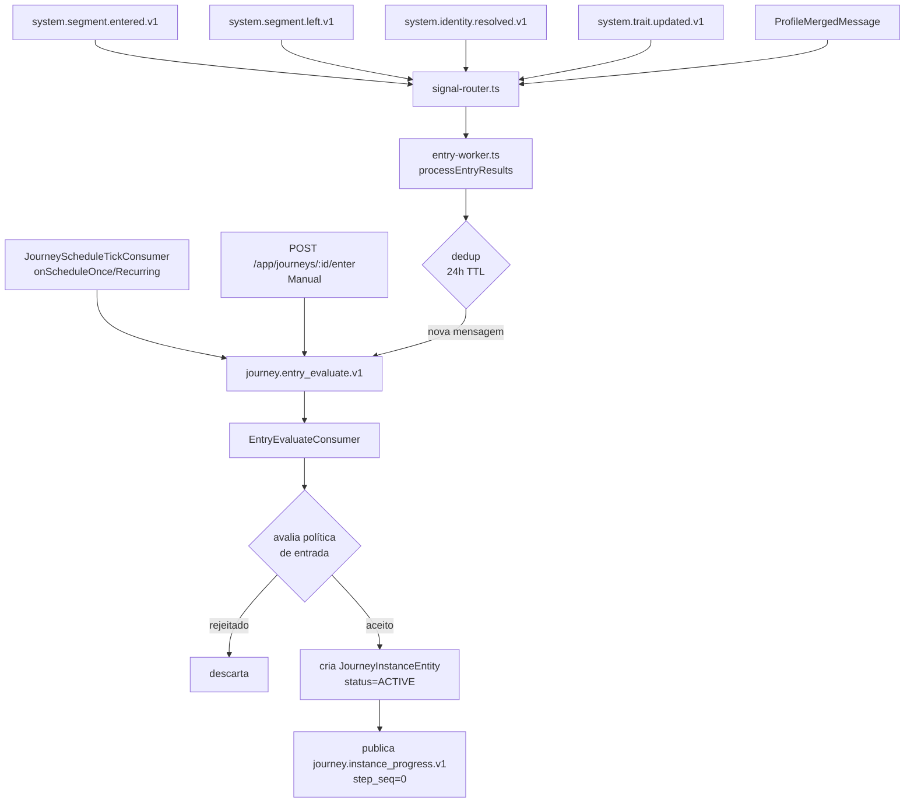

# Jornadas — Gatilhos — Mapa da Engine

> Documento técnico gerado a partir do código-fonte do `prismaflow-mss`, dos 11 prints
> de gatilho e das keywords fornecidas. Um dos três documentos do módulo de jornadas.
> Data: 2026-06-28.

---

## 1. Resumo executivo

Gatilhos são o ponto de entrada de uma jornada. Eles definem qual sinal externo coloca
um perfil na fila de avaliação de entrada. Existem 8 tipos de gatilho: 4 reativos
(Entrou no segmento, Saiu do segmento, Identidade resolvida, Trait atualizado), 1 de
merge (Perfil mesclado), 2 de agendamento (Agendamento único, Agendamento recorrente)
e 1 manual (Manual). Cada gatilho chega como uma mensagem Kafka ou chamada HTTP que
aciona o `signal-router.ts`, o qual filtra quais versões de jornada publicadas devem
receber o perfil para avaliação de entrada. A política de entrada (entrada/reentrada)
decide se o perfil pode de fato criar uma nova instância, ou se é bloqueado.

---

## 2. Glossário e keywords

| Termo na UI | Nome no código |
|---|---|
| Gatilho | `JourneyDefinitionTrigger { type: JourneyTriggerType; config? }` |
| Tipo de gatilho | `JourneyTriggerType` (enum, 8 valores) |
| Entrou no segmento | `JourneyTriggerType.OnSegmentEntered = "on_segment_entered"` |
| Saiu do segmento | `JourneyTriggerType.OnSegmentLeft = "on_segment_left"` |
| Identidade resolvida | `JourneyTriggerType.OnIdentityResolved = "on_identity_resolved"` |
| Trait atualizado | `JourneyTriggerType.OnTraitUpdated = "on_trait_updated"` |
| Perfil mesclado | `JourneyTriggerType.OnProfileMerged = "on_profile_merged"` |
| Agendamento único | `JourneyTriggerType.OnScheduleOnce = "on_schedule_once"` |
| Agendamento recorrente | `JourneyTriggerType.OnScheduleRecurring = "on_schedule_recurring"` |
| Manual | `JourneyTriggerType.Manual = "manual"` |
| Segmento | `config.segment_id` no trigger config |
| Chave do trait | `config.trait_key` |
| Eventos elegíveis | `config.event_keys[]` no trigger config de identidade |
| Tipos de identidade | `config.identity_types[]` |
| Audiência | `config.audience` nos triggers de agendamento |
| Fuso horário | `config.timezone` |
| Expressão cron | `config.cron` |
| Política de entrada | `JourneyEntryPolicy { mode: JourneyEntryPolicyMode; cooldown? }` |
| Uma vez (sempre) | `JourneyEntryPolicyMode.ONCE_EVER = "once_ever"` |
| Uma vez enquanto ativa | `JourneyEntryPolicyMode.ONCE_WHILE_ACTIVE = "once_while_active"` |
| Reentrar após cooldown | `JourneyEntryPolicyMode.REENTER_AFTER_COOLDOWN = "reenter_after_cooldown"` |
| Filtros adicionais (TODAS/QUALQUER/NENHUMA) | ver §9 Lacunas |
| Chave (key) da jornada | `journey.key` — slug único por app |
| trigger summary | `JourneyVersionEntity.triggerSummary { type, config }` — indexado para routing rápido |

---

## 3. Visão geral do fluxo



**Narrativa:** um evento externo chega via Kafka ou HTTP. O `routeSignal` busca todas as
versões de jornada publicadas que têm aquele tipo de gatilho indexado e filtra as que
batem com o config específico (ex: mesmo `segment_id`). Para cada match, o
`entry-worker` publica no tópico interno `journey.entry_evaluate.v1` com deduplicação
por `source_message:journeyId:profileId:messageId`. O `EntryEvaluateConsumer` avalia a
política de entrada e, se aceita, cria a instância e dispara a progressão (passo 0).

---

## 4. Pontos de entrada por tipo de gatilho

### 4.1 Entrou no segmento (`ON_SEGMENT_ENTERED`)

```
Tópico consumido: system.segment.entered.v1
Consumer: apps/v1-api-journey/src/consumers/segment-events.consumer.ts:65
```

Payload recebido:
```typescript
{ app_id, segment_id, profile_id, segment_version, action: "entered", occurred_at, evaluated_at }
```

O `SegmentEventsConsumer` chama `routeSignal` com o `SegmentEnteredMessage`. O
`matchesTriggerConfig` filtra jornadas cujo `config.segment_id === signal.data.segment_id`.
Além disso, verifica active waits de instâncias já em execução que estavam esperando
entrada nesse segmento (`matchSegmentToActiveWaits`).

### 4.2 Saiu do segmento (`ON_SEGMENT_LEFT`)

```
Tópico consumido: system.segment.left.v1
Consumer: apps/v1-api-journey/src/consumers/segment-events.consumer.ts:65
```

Mesmo fluxo do `ON_SEGMENT_ENTERED`. `matchesTriggerConfig` filtra por `segment_id`.
Também avança waits do tipo `UNTIL_SEGMENT` que aguardavam a saída.

### 4.3 Identidade resolvida (`ON_IDENTITY_RESOLVED`)

```
Tópico consumido: system.identity.resolved.v1
Consumer: apps/v1-api-journey/src/consumers/identity-resolved.consumer.ts
```

O `IdentityResolvedConsumer` chama `routeSignal`. Em `matchesTriggerConfig`:

```typescript
// apps/v1-api-journey/src/domain/signal-router.ts:232-235
case IdentityEventType.Resolved:
  return (
    config.event_key === signal.data.event_key ||
    (Array.isArray(config.event_keys) && config.event_keys.includes(signal.data.event_key))
  );
```

A UI mostra "Eventos elegíveis (opcional)" com pares `Evento + Versão`. No backend
o event_key tem formato `NomeEvento@versão` (ex: `"Purchase@1"`). Se `config.event_keys`
estiver vazio ou não definido, qualquer identidade resolvida aciona o gatilho.

O campo "Tipos de identidade (opcional)" filtra por tipo de identidade no `config.identity_types[]`
(ex: email, phone) — usado para disparar apenas quando um identity type específico é
resolvido.

### 4.4 Trait atualizado (`ON_TRAIT_UPDATED`)

```
Tópico consumido: system.trait.updated.v1
Consumer: apps/v1-api-journey/src/consumers/trait-updated.consumer.ts
```

Em `matchesTriggerConfig`:

```typescript
// apps/v1-api-journey/src/domain/signal-router.ts:247-265
function matchesTraitUpdated(config, data): boolean {
  if (config.trait_key !== data.trait_key) return false;

  // Filtro de transição específica (de → para)
  if (config.transition !== undefined) {
    return config.transition.from === data.old_value && config.transition.to === data.new_value;
  }

  // Filtro de valor específico (novo valor = X)
  if (config.value !== undefined) {
    return config.value === data.new_value;
  }

  // Sem filtro de valor: qualquer mudança do trait dispara
  return true;
}
```

O campo "Chave do trait *" mapeia para `config.trait_key`. O backend recebe `trait_key`,
`old_value` e `new_value` no sinal — permite filtrar transições específicas de valor.

### 4.5 Perfil mesclado (`ON_PROFILE_MERGED`)

```
Tópico consumido: system.identity.profile_merged.v1
Consumer: apps/v1-api-journey/src/consumers/profile-merged.consumer.ts
```

`matchesTriggerConfig` retorna `true` sempre:

```typescript
// apps/v1-api-journey/src/domain/signal-router.ts:239-241
case IdentityEventType.ProfileMerged:
  return true;
```

Sem configuração adicional — a UI mostra "Aciona automaticamente quando perfis são
mesclados; sem configuração adicional." O `profileId` roteado é o `winner_profile_id`
(perfil que sobreviveu ao merge). As `entryEventProperties` incluem `winner_profile_id`,
`loser_profile_id`, `source_event_id`, `source_event_key` e `reason`.

### 4.6 Agendamento único (`ON_SCHEDULE_ONCE`)

```
Consumer: apps/v1-api-journey/src/consumers/journey-schedule-tick.consumer.ts:86
Scheduler topic: scheduler.journey.schedule.v1 (periódico)
```

Ao publicar a jornada, o backend cria um `JourneyScheduleJobEntity` com `kind = "once"`,
`scheduled_at = <data + hora + timezone>`. O `JourneyScheduleTickConsumer` roda
periodicamente, busca jobs com `next_run_at <= now` e:

1. Chama `resolveScheduleAudience()` → obtém `profileIds` da audiência configurada
2. Para cada perfil, publica `journey.entry_evaluate.v1` com `trigger_type = OnScheduleOnce`
3. Chama `markFired(jobId, now, nextRunAt=null)` — job de uso único, sem próximo disparo

A "Audiência *" pode ser um segmento (`kind: "segment_id"`) ou todos os perfis do app
(`kind: "all"`). O `resolveScheduleAudience` lê `segment_membership_state` para resolver
membros do segmento.

```typescript
// apps/v1-api-journey/src/consumers/journey-schedule-tick.consumer.ts:144-155
const entryKey = `schedule:${job.jobId}:${profileId}:${firedAt}`;
data = {
  ...
  entry_event_type: EntryEventType.SCHEDULE_ONCE,
  trigger_type: JourneyTriggerType.OnScheduleOnce,
  trigger_payload: { job_id: job.jobId },
};
```

### 4.7 Agendamento recorrente (`ON_SCHEDULE_RECURRING`)

```
Consumer: apps/v1-api-journey/src/consumers/journey-schedule-tick.consumer.ts:86
```

Mesmo fluxo do agendamento único, mas `kind = "recurring"` e `job.cron` é não-nulo.
Ao disparar, chama `computeNextRunAt(job.cron, new Date(), job.timezone)` e grava o
próximo horário em `markFired`.

A UI oferece 4 abas de configuração de cron:

| Aba UI | Cron gerado (exemplo) | Tradução humana |
|---|---|---|
| Diária `09:00` | `0 9 * * *` | Diariamente às 09:00 |
| Semanal `Seg 09:00` | `0 9 * * 1` | Toda segunda-feira às 09:00 |
| Mensal `dia 1 09:00` | `0 9 1 * *` | Todo dia 1 do mês às 09:00 |
| Avançado | expressão cron raw | Qualquer expressão 5-partes |

Formato da expressão: `minuto hora dia-do-mês mês dia-da-semana` (0=domingo).
O frontend converte as abas em expressão cron antes de salvar; o backend guarda apenas
a expressão e o timezone como string.

### 4.8 Manual (`MANUAL`)

```
Rota HTTP: POST /app/journeys/:journey_id/enter
Handler: apps/v1-api-journey/src/handlers/enter-journey.handler.ts
Domain: apps/v1-api-journey/src/domain/process-manual-entry.ts
```

Sem configuração adicional de trigger. A jornada "Manual" é acionada via chamada HTTP
direta (API ou UI "Acionar jornada"). O handler autentica, valida que a jornada está
publicada, e publica `EntryEvaluateMessage` com `trigger_type = Manual`.

```typescript
// packages/shared/src/types/index.ts:1273
MANUAL = "manual",
```

---

## 5. Signal Router — como o backend roteia o sinal

```typescript
// apps/v1-api-journey/src/domain/signal-router.ts:160-219
export async function routeSignal(deps, appId, signal): Promise<SignalRouteResult[]> {
  const trigger = buildTrigger(signal);          // mapeia mensagem → JourneyTriggerType

  const versions = await journeyVersionRepository.findPublishedByTriggerType(
    appId,
    trigger.triggerType
  );  // consulta índice de journey_versions por trigger_type (sem scan total)

  const matched = versions.filter((version) => matchesTriggerConfig(signal, version));
  // Ex: para SEGMENT, filtra por segment_id; para TRAIT, filtra trait_key + valor/transição

  return matched.map((version) => ({
    journeyId, journeyVersionId, profileId, sourceMessageId, trigger,
    entryEventProperties: buildEntryEventProperties(signal),
    ...buildEntryEventContext(signal),  // entryEventType + entryEventId + entrySegmentId
  }));
}
```

**Indexação**: `findPublishedByTriggerType` usa índice em `journey_versions` por
`(app_id, trigger_type, status)` — lookup O(1) por tipo de gatilho, sem varrer todas
as jornadas do app.

**Propriedades de entrada** (`entryEventProperties`) por tipo:

| Gatilho | Propriedades salvas na instância |
|---|---|
| Segmento entrou/saiu | `segment_id, segment_version, reason, evaluated_at` |
| Identidade resolvida | `properties` do evento de identidade |
| Trait atualizado | `trait_key, new_value, old_value, source` |
| Perfil mesclado | `winner_profile_id, loser_profile_id, source_event_id, source_event_key, reason` |

---

## 6. Deduplicação de entrada (entry-worker)

```typescript
// apps/v1-api-journey/src/domain/entry-worker.ts:14,90-107
const DEDUP_TTL_MS = 24 * 60 * 60 * 1000;  // 24h

const dedupKey = `source_message:${result.journeyId}:${result.profileId}:${result.sourceMessageId}`;
const existing = await journeyEntryDedupRepository.findByDedupKey(
  appId, JourneyEntryDedupScope.SOURCE_MESSAGE, dedupKey
);
if (existing) { deduplicatedCount++; continue; }
```

Antes de publicar `journey.entry_evaluate.v1`, o `entry-worker` salva um registro de
dedup em `journey_entry_dedup` com TTL de 24h por `(journeyId, profileId, sourceMessageId)`.
Isso evita que a mesma mensagem Kafka (replay ou reprocessamento) crie duas instâncias.

Esta dedup é de **primeira camada** (por mensagem fonte). A política de entrada é a
**segunda camada** (lógica de negócio de quantas vezes o perfil pode entrar).

---

## 7. Política de entrada — avaliação detalhada

```typescript
// apps/v1-api-journey/src/domain/evaluate-entry-policy.ts:36-128
export async function evaluateEntryPolicy(deps, input): Promise<EntryDecision> {
  switch (entryPolicy.mode) {
    case JourneyEntryPolicyMode.ONCE_EVER:
      // Verifica se existe QUALQUER instância (qualquer status) para esse perfil + jornada
      const exists = await journeyInstanceRepository.existsByProfileAndJourney(appId, profileId, journeyId);
      if (exists) return { outcome: "rejected_policy", reason: "instance_exists_once_ever" };
      return { outcome: "accepted" };

    case JourneyEntryPolicyMode.ONCE_WHILE_ACTIVE:
      // Verifica se existe instância ATIVA para esse perfil + jornada
      const instances = await journeyInstanceRepository.findActiveByProfileAndJourney(appId, profileId, journeyId);
      if (instances.length > 0) return { outcome: "rejected_policy", reason: "active_instance_exists", activeInstanceId };
      return { outcome: "accepted" };

    case JourneyEntryPolicyMode.REENTER_AFTER_COOLDOWN:
      // 1. Verifica ativa → rejeita
      // 2. Busca última instância terminal (COMPLETED, CONVERTED, CANCELLED, etc.)
      // 3. Calcula cooldownUntil = terminal.endedAt + cooldown.value em minutos/horas/dias
      // 4. Se occurredAt < cooldownUntil → rejeita "cooldown_not_met"
      const cooldownUntil = calculateCooldownUntil(terminal.endedAt, entryPolicy.cooldown);
      if ((occurredAt ?? new Date()) < cooldownUntil) return { outcome: "rejected_policy", reason: "cooldown_not_met", cooldownUntil };
      return { outcome: "accepted" };
  }
}
```

**Modos de política:**

| Modo UI | Modo código | Comportamento |
|---|---|---|
| Uma vez (sempre) | `ONCE_EVER` | Rejeita se existir qualquer instância (até cancelada/expirada) |
| Uma vez enquanto ativa | `ONCE_WHILE_ACTIVE` | Rejeita se existir instância ACTIVE ou WAITING |
| Reentrar após cooldown | `REENTER_AFTER_COOLDOWN` | Aceita se lastTerminal.endedAt + cooldown ≤ occurredAt |

O campo de cooldown aceita unidades `minute | hour | day` (`TimeUnit`). Referência:
`terminal.endedAt ?? terminal.updatedAt` — usa `updatedAt` como fallback se `endedAt`
for nulo.

**Deduplicação da política** (segunda camada, dentro do `EntryEvaluateConsumer`):

```typescript
// apps/v1-api-journey/src/consumers/entry-evaluate.consumer.ts:118-159
const dedupParams = buildEntryDedupParams(version.entryPolicy, journeyId, profileId, occurredAt);
// Para ONCE_EVER: dedupKey = "policy:once_ever:{journeyId}:{profileId}", expiresAt=null
// Para ONCE_WHILE_ACTIVE: dedupKey = "policy:once_active:{journeyId}:{profileId}", expiresAt=null
// Para REENTER_AFTER_COOLDOWN: dedupKey = "policy:cooldown:{journeyId}:{profileId}:YYYY-MM", expiresAt=cooldownUntil
```

Existe uma terceira proteção contra race condition: se dois `EntryEvaluateConsumer`
processam o mesmo perfil simultaneamente, o `INSERT` de dedup tem constraint único e
o segundo falha com `error.code === "23505"` — tratado silenciosamente.

---

## 8. Criação da instância

```typescript
// apps/v1-api-journey/src/consumers/entry-evaluate.consumer.ts:164-248
await withTransaction(pool, async (client) => {
  // 1. Insere registro de dedup (com UNIQUE constraint)
  await journeyEntryDedupRepository.create(dedupEntity, client);

  // 2. Cria a instância
  const instanceEntity = JourneyInstanceEntity.create({
    appId,
    journeyId, journeyVersionId, profileId,
    status: JourneyInstanceStatus.ACTIVE,
    entrySource: JourneyEntrySource.TRIGGER,  // ou MANUAL, BULK, etc.
    sourceMessageId,
    correlationId,
    entryKey,
    entryEventProperties,     // propriedades do sinal de entrada
    entryEventType,           // SEGMENT_ENTERED, IDENTITY_RESOLVED, etc.
    entryEventId,             // id do evento de identidade (se houver)
    entrySegmentId,           // id do segmento (se gatilho de segmento)
  });

  await journeyInstanceRepository.create(instanceEntity, client);

  // 3. Outbox: INSTANCE_STARTED (para auditoria externa)
  await journeyOutboxEventRepository.insert(outboxEvent, client);

  // 4. Histórico
  await journeyInstanceHistoryRepository.create(INSTANCE_STARTED, client);
});

// 5. Dispara progressão (fora da tx)
await journeyInternalProducer.publishInstanceProgress({
  instance_id, step_seq: 0, reason: InstanceProgressReason.ENTRY
});
```

---

## 9. Regras de negócio e validações

### 9.1 Chave (key) da jornada

O campo "Chave (key) *" da jornada (ex: `journey-7cb4bc71-...`) é gerado automaticamente
mas editável. Aceita apenas letras minúsculas, números, `-` e `_`. É um slug único por
app — usado para referenciar a jornada via API manual sem expor UUIDs.

### 9.2 Versões de jornada e trigger summary

Ao publicar uma jornada, o backend cria um `JourneyVersionEntity` com:
- `triggerSummary`: snapshot do tipo + config do trigger (indexado para `findPublishedByTriggerType`)
- `entryPolicy`: snapshot da política de entrada
- `compiled`: grafo compilado da jornada

O `triggerSummary` é desnormalizado justamente para evitar join com o nó TRIGGER ao
rotear sinais em alto throughput.

### 9.3 Jornada publicada x rascunho

`routeSignal` busca apenas versões com `status = 'published'`. Jornadas em rascunho
são completamente invisíveis ao roteamento de sinais — não recebem perfis.

### 9.4 Jornada Manual e política de entrada

Uma jornada com gatilho `MANUAL` ainda avalia a política de entrada. Se a política for
`ONCE_EVER`, chamadas manuais repetidas para o mesmo perfil são silenciosamente rejeitadas.

### 9.5 Stale tick detection

Para agendamentos, o `JourneyScheduleTickConsumer` verifica se o tick é stale:

```typescript
// apps/v1-api-journey/src/consumers/journey-schedule-tick.consumer.ts:62-67
if (isSchedulerTickStale(message.occurred_at)) {
  logger.debug("journey schedule tick: skipping stale message", ...);
  return;
}
```

`isSchedulerTickStale` compara `occurred_at` com `now - threshold`. Ticks velhos são
descartados sem processar.

### 9.6 Replay com cooldown expirado

```typescript
// apps/v1-api-journey/src/consumers/entry-evaluate.consumer.ts:125-137
if (metadata.isReplay === true && dedupParams?.expiresAt !== null) {
  if (dedupParams.expiresAt.getTime() < Date.now()) {
    logger.info("replay event with expired cooldown rejected", ...);
    return;
  }
}
```

Replays de mensagens com cooldown que já expirou são descartados — evita que
reprocessamento de DLQ crie instâncias indevidas após o cooldown ter passado.

---

## 10. Modelo de dados relevante

### Tabela `journey_versions` (PostgreSQL journey-rds)

| Coluna | Tipo | Uso |
|---|---|---|
| `trigger_type` | TEXT | Indexado — `findPublishedByTriggerType` |
| `trigger_summary` | JSONB | `{ type, config }` — snapshot do trigger |
| `entry_policy` | JSONB | `{ mode, cooldown? }` |
| `compiled` | JSONB | Grafo compilado |
| `status` | TEXT | `draft` / `published` / `archived` |

### Tabela `journey_instances` (PostgreSQL journey-rds)

| Coluna relevante | Significado |
|---|---|
| `entry_source` | `trigger` / `manual` / `bulk` / `reentry` / `enter_journey` |
| `entry_event_type` | `segment_entered` / `identity_resolved` / `trait_updated` / etc. |
| `entry_event_properties` | JSONB com propriedades do sinal de entrada |
| `entry_event_id` | ID do evento de identidade que disparou |
| `entry_segment_id` | ID do segmento (para triggers de segmento) |

### Tabela `journey_entry_dedup` (PostgreSQL journey-rds)

```sql
-- Protege contra replay e concorrência
(app_id, dedup_scope, dedup_key) UNIQUE
expires_at TIMESTAMPTZ NULL   -- NULL = nunca expira (ONCE_EVER)
```

### Tabela `journey_schedule_jobs` (PostgreSQL journey-rds)

| Coluna | Significado |
|---|---|
| `kind` | `once` / `recurring` |
| `cron` | Expressão cron (NULL para `once`) |
| `timezone` | ex: `"America/Sao_Paulo"` |
| `audience` | JSONB `{ kind: "segment_id", segment_id }` ou `{ kind: "all" }` |
| `next_run_at` | Próximo disparo (NULL após disparar para `once`) |
| `last_fired_at` | Último disparo |

---

## 11. Eventos e mensageria

### Tópicos consumidos pelo v1-api-journey para gatilhos

| Tópico | Consumer | Gatilho |
|---|---|---|
| `system.segment.entered.v1` | `SegmentEventsConsumer` | ON_SEGMENT_ENTERED |
| `system.segment.left.v1` | `SegmentEventsConsumer` | ON_SEGMENT_LEFT |
| `system.identity.resolved.v1` | `IdentityResolvedConsumer` | ON_IDENTITY_RESOLVED |
| `system.trait.updated.v1` | `TraitUpdatedConsumer` | ON_TRAIT_UPDATED |
| `system.identity.profile_merged.v1` | `ProfileMergedConsumer` | ON_PROFILE_MERGED |
| `scheduler.journey.schedule.v1` | `JourneyScheduleTickConsumer` | ON_SCHEDULE_ONCE / RECURRING |

### Tópico interno publicado

| Tópico | Producer | Payload |
|---|---|---|
| `journey.entry_evaluate.v1` | `entry-worker.ts`, `JourneyScheduleTickConsumer`, `EnterJourneyHandler` | `EntryEvaluateMessage { journey_id, journey_version_id, profile_id, trigger_type, trigger_payload, entry_key, entry_event_type, ... }` |

---

## 12. O que NÃO aparece no frontend

### 12.1 Deduplicação de entrada (duas camadas)

O operador não vê que existem dois mecanismos de dedup: um por `source_message_id` (24h,
no `entry-worker`) e outro por política (sem expiração para ONCE_EVER, com expiração
para cooldown). Perfis rejeitados nunca aparecem como "tentativa" na UI.

### 12.2 `entryEventProperties` na instância

As propriedades do sinal que disparou a entrada (ex: `segment_version`, `old_value` do
trait) são armazenadas na instância mas não são exibidas diretamente na UI de jornadas.
Podem ser usadas em variáveis de ação via `variable_mapping`.

### 12.3 `triggerSummary` desnormalizado

A versão da jornada guarda um snapshot `triggerSummary` separado do nó TRIGGER no grafo.
É uma otimização de leitura — o roteamento de sinais não precisa deserializar o grafo
completo para descobrir o tipo de gatilho.

### 12.4 Cooldown com base em `endedAt ?? updatedAt`

O cooldown é calculado a partir de `terminal.endedAt ?? terminal.updatedAt`. Se a
instância foi cancelada forçosamente e não tem `endedAt`, o cooldown começa em
`updatedAt`. O operador configura apenas o tempo de cooldown — não sabe que o ponto
de referência pode mudar.

### 12.5 Race condition silenciosa

Duas avaliações concorrentes para o mesmo perfil tentando entrar na mesma jornada ao
mesmo tempo resultam em um `23505 unique_violation` no segundo — tratado silenciosamente.
O perfil entra uma vez. Nenhuma mensagem de erro, nenhum alerta.

---

## 13. Tratamento de erros e edge cases

| Situação | Tratamento |
|---|---|
| Journey version não encontrada no `EntryEvaluateConsumer` | Log warn + descarte silencioso |
| Política rejeitada | Log info + retorno sem criar instância |
| Race condition no INSERT de dedup (23505) | Incrementa `journeyEntryDeduplicatedTotal` + retorno silencioso |
| Tick stale do scheduler | Log debug + descarte |
| Replay com cooldown expirado | Log info + descarte |
| Segmento não encontrado (audience resolution) | `resolveScheduleAudience` retorna `[]` |

---

## 14. Configuração

| Variável | Padrão | Efeito |
|---|---|---|
| Scheduler tick batch_size | `100` | Máx jobs por tick de schedule |
| Entry dedup TTL | `24h` | Janela de dedup por `source_message_id` |
| Cooldown | configurado por jornada | Mínimo: 1 minuto; Unidades: minute/hour/day |

---

## 15. Índice de referências de código

| Referência | Tema |
|---|---|
| `apps/v1-api-journey/src/domain/signal-router.ts:160-219` | `routeSignal` — roteamento completo |
| `apps/v1-api-journey/src/domain/signal-router.ts:222-265` | `matchesTriggerConfig` — filtragem por tipo |
| `apps/v1-api-journey/src/domain/signal-router.ts:247-265` | `matchesTraitUpdated` — filtro de transição |
| `apps/v1-api-journey/src/domain/entry-worker.ts:78-150` | `processEntryResults` — dedup + publish |
| `apps/v1-api-journey/src/consumers/entry-evaluate.consumer.ts:80-275` | Avalia política + cria instância |
| `apps/v1-api-journey/src/domain/evaluate-entry-policy.ts:36-128` | `evaluateEntryPolicy` — 3 modos |
| `apps/v1-api-journey/src/domain/evaluate-entry-policy.ts:23-34` | `calculateCooldownUntil` |
| `apps/v1-api-journey/src/consumers/journey-schedule-tick.consumer.ts:59-186` | Schedule tick completo |
| `apps/v1-api-journey/src/domain/resolve-schedule-audience.ts` | Resolução de audiência (segmento ou all) |
| `apps/v1-api-journey/src/consumers/segment-events.consumer.ts:65-110` | Segment entered/left consumer |
| `apps/v1-api-journey/src/consumers/identity-resolved.consumer.ts` | Identity resolved consumer |
| `apps/v1-api-journey/src/consumers/trait-updated.consumer.ts` | Trait updated consumer |
| `apps/v1-api-journey/src/consumers/profile-merged.consumer.ts` | Profile merged consumer |
| `packages/shared/src/types/index.ts:1265-1280` | `JourneyTriggerType`, `JourneyEntryPolicyMode` |
| `packages/shared/src/types/index.ts:1062-1079` | `JourneyEntrySource`, `EntryEventType` |

---

## 16. Lacunas e incertezas

1. **Filtros adicionais TODAS/QUALQUER/NENHUMA na UI de segmento**: A UI mostra um
   seletor de operador booleano e "Adicionar condição" nos gatilhos de segmento. No
   código, `matchesTriggerConfig` para `SegmentEventType.Entered/Left` verifica apenas
   `config.segment_id === signal.data.segment_id`. Não foi encontrado onde essas
   condições adicionais são avaliadas. Possibilidades: (a) são avaliadas em um step
   posterior não rastreado; (b) são enviadas como condição no `triggerSummary.config`
   e avaliadas por um path do `EntryEvaluateConsumer` não lido; (c) são uma feature
   em construção que ainda não tem avaliação backend.

2. **Tipos de identidade no gatilho de Identidade resolvida**: O campo "Tipos de
   identidade (opcional)" aparece na UI mas não foi rastreado onde `config.identity_types`
   é avaliado no `matchesTriggerConfig` para `IdentityEventType.Resolved`. O código
   atual só checa `event_key` / `event_keys`. Pode ser filtrado no consumer antes de
   chamar `routeSignal`, ou ser uma lacuna de implementação.

3. **Gatilho Manual via API externa**: Não foi rastreado se o endpoint
   `POST /app/journeys/:id/enter` tem autenticação via API Key do produto vs. autenticação
   de admin. Relevante para documentar o caso de uso de entrada programática.

4. **`journey_schedule_jobs` lifecycle**: Não foi confirmado quando/onde os
   `JourneyScheduleJobEntity` são criados (provavelmente no `PublishJourneyVersionHandler`)
   nem como são limpos quando a jornada é arquivada.

5. **Política de entrada para `ENTER_JOURNEY` (ação)**: O `JourneyEntrySource.ENTER_JOURNEY`
   existe mas não foi rastreado se segue o mesmo fluxo de `evaluateEntryPolicy` quando
   um nó ACTION de outra jornada inicia essa jornada.
