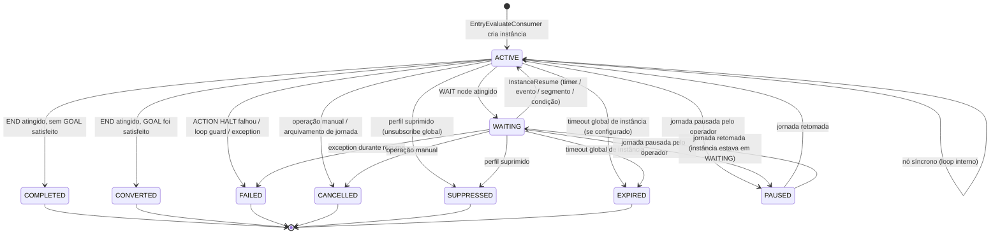

# Jornadas — Motor de Progressão — Mapa da Engine

> Documento técnico gerado a partir do código-fonte do `prismaflow-mss`, dos prints de
> fluxo (15, 16) e das keywords fornecidas. Um dos três documentos do módulo de jornadas.
> Cobre a visão geral end-to-end do sistema de progressão de instâncias.
> Data: 2026-06-28.

---

## 1. Resumo executivo

O motor de progressão de jornadas é o conjunto de consumers, domain functions, entidades
de banco e tópicos Kafka que orquestram a execução de uma instância de jornada — desde
o momento em que um perfil é aceito até o encerramento como `COMPLETED` ou `CONVERTED`.

O loop de progressão (`InstanceProgressConsumer`) é o coração do sistema: ele executa
nós síncrono atrás de síncrono no mesmo ciclo de processamento, e para nos nós
assíncronos (WAIT, ACTION, GOAL), aguardando que eventos externos retomem a instância.
Cada retomada chega via Kafka com um `step_seq` que garante idempotência. O acesso
exclusivo via `FOR UPDATE` impede que dois workers processem a mesma instância
simultaneamente. Um loop guard de 100 passos protege contra grafos malformados.

---

## 2. Glossário e keywords

| Termo na UI | Nome no código |
|---|---|
| Jornada publicada | `JourneyVersionEntity { status: "published" }` |
| Instância | `JourneyInstanceEntity` — execução de um perfil × versão de jornada |
| Passo | `step_seq: number` — contador inteiro monotonicamente crescente |
| Loop de progressão | `InstanceProgressConsumer.processMessage()` |
| Retomada | `InstanceResume` — sinal que retoma uma instância assíncrona |
| Razão de retomada | `InstanceProgressReason` — enum descrevendo o motivo do passo |
| Nó síncrono | `ProgressionClassification.SYNC` — avança no mesmo loop sem publicar Kafka |
| Nó assíncrono | `ProgressionClassification.ASYNC` — interrompe, aguarda evento externo |
| Grafo compilado | `CompiledGraph { nodes, edges }` — snapshot do builder, gravado em `journey_versions.compiled` |
| Sinal | Mensagem Kafka externa que aciona o roteamento (segmento, trait, identidade, etc.) |
| Entry key | Chave de dedup de entrada (`schedule:{jobId}:{profileId}:{firedAt}` ou `source_message:{...}`) |
| Motor de signal | `signal-router.ts` — mapeia sinal externo → versões de jornada elegíveis |
| Outbox | `journey_outbox_events` — tabela de eventos a publicar pós-transação |
| OutboxAggregateType | `JOURNEY_INSTANCE` — tipo do aggregate para outbox de instâncias |
| `INSTANCE_STARTED` | Evento de outbox emitido quando a instância é criada |
| `ACTION_DISPATCH` | Evento de outbox emitido quando um nó ACTION é atingido |
| `INSTANCE_COMPLETED` | Evento de outbox emitido ao atingir END sem conversão |
| `INSTANCE_CONVERTED` | Evento de outbox emitido ao atingir END com GOAL satisfeito |
| Status da instância | `JourneyInstanceStatus` (9 valores) |

---

## 3. Arquitetura geral — visão end-to-end

```mermaid
flowchart TD
    subgraph Sinais externos
        S1[system.segment.entered.v1]
        S2[system.trait.updated.v1]
        S3[system.identity.resolved.v1]
        S4[ProfileMerged]
        S5[scheduler.journey.schedule.v1]
        S6[POST /app/journeys/:id/enter]
    end

    subgraph Fase 1 — Roteamento
        SR[signal-router.ts\nrouteSignal → matchesTriggerConfig]
        EW[entry-worker.ts\nprocessEntryResults\ndedup 24h por sourceMessageId]
    end

    subgraph Fase 2 — Avaliação de entrada
        EEC[EntryEvaluateConsumer\njourney.entry_evaluate.v1]
        POL[evaluateEntryPolicy\nONCE_EVER / ONCE_WHILE_ACTIVE\nREENTER_AFTER_COOLDOWN]
        DB1[(journey_instances\njourney_entry_dedup\njourney_outbox_events\njourney_instance_history)]
    end

    subgraph Fase 3 — Loop de progressão
        IPC[InstanceProgressConsumer\njourney.instance_progress.v1]
        LOOP[for loop\nFOR UPDATE on instance\ncheckLoopGuard maxSteps=100]
        PE[progress-engine.ts\nresolveNextNode\nclassifyNodeProgression]
    end

    subgraph Nós síncronos no loop
        NT[TRIGGER\nskip — continua]
        NC[CONDITION\nevaluateCondition\nMongoDB + ClickHouse]
        NAB[AB_TEST\nselectAbVariant\nDJB2 hash]
        NE[END\nupdateStatus → COMPLETED/CONVERTED]
    end

    subgraph Nós assíncronos — break do loop
        NW[WAIT\nresolveWaitTiming\ncria JourneyWaitEntity]
        NA[ACTION\nresolveActionVariables\ncria JourneyActionEntity\noutbox ACTION_DISPATCH]
        NG[GOAL\nevaluateGoalImmediate\ncria JourneyGoalEntity LISTENING]
    end

    subgraph Fase 4 — Eventos de retomada
        WTC[WaitScheduleTickConsumer\nTIMER_ELAPSED / EXPIRED]
        MEW[MatchEventToWaits\nEVENT_RECEIVED]
        MCW[MatchConditionToActiveWaits\nCONDITION_MET]
        MSW[SegmentConsumer → match waits\nSEGMENT_CHANGED]
        ADC[ActionDispatchConsumer\nACTION_COMPLETED / ACTION_FAILED]
        GCC[GoalCheckConsumer\nGOAL_SATISFIED]
        GEC[GoalExpirationTickConsumer\nGOAL_EXPIRED]
        IRC[InstanceResumeConsumer\njourney.instance_resume.v1]
    end

    S1 --> SR
    S2 --> SR
    S3 --> SR
    S4 --> SR
    SR --> EW
    S5 --> EEC
    S6 --> EEC
    EW --> EEC
    EEC --> POL
    POL --> DB1
    DB1 --> |journey.instance_progress.v1 step_seq=0| IPC

    IPC --> LOOP
    LOOP --> PE
    PE --> NT
    PE --> NC
    PE --> NAB
    PE --> NE
    PE --> NW
    PE --> NA
    PE --> NG

    NT --> LOOP
    NC --> LOOP
    NAB --> LOOP
    NE --> |instância fechada| DONE[Done]

    NW --> WTC
    NW --> MEW
    NW --> MCW
    NW --> MSW
    NA --> ADC
    NG --> GCC
    NG --> GEC

    WTC --> IRC
    MEW --> IRC
    MCW --> IRC
    MSW --> IRC
    ADC --> IRC
    GCC --> IRC
    GEC --> IRC

    IRC --> |journey.instance_progress.v1 step_seq=N| IPC
```

---

## 4. Fase 1 — Roteamento de sinais

### 4.1 signal-router.ts

```typescript
// apps/v1-api-journey/src/domain/signal-router.ts:160-219
export async function routeSignal(deps, appId, signal): Promise<SignalRouteResult[]> {
  const trigger = buildTrigger(signal);
  const versions = await journeyVersionRepository.findPublishedByTriggerType(
    appId,
    trigger.triggerType
  );
  const matched = versions.filter((version) => matchesTriggerConfig(signal, version));
  return matched.map((version) => ({
    journeyId, journeyVersionId, profileId,
    sourceMessageId, trigger, entryEventProperties, ...
  }));
}
```

`findPublishedByTriggerType` usa índice em `(app_id, trigger_type, status)`. Para cada
`SignalRouteResult` retornado, o `entry-worker` publica uma mensagem no tópico de
avaliação de entrada.

### 4.2 entry-worker.ts

```typescript
// apps/v1-api-journey/src/domain/entry-worker.ts:78-150
const DEDUP_TTL_MS = 24 * 60 * 60 * 1000;

export async function processEntryResults(deps, appId, results): Promise<void> {
  for (const result of results) {
    const dedupKey = `source_message:${result.journeyId}:${result.profileId}:${result.sourceMessageId}`;
    const existing = await journeyEntryDedupRepository.findByDedupKey(appId, dedupKey);
    if (existing) continue;  // descarta replay / reprocessamento

    await journeyEntryDedupRepository.create({ dedupKey, expiresAt: now + TTL });
    await journeyInternalProducer.publishEntryEvaluate({
      journey_id, journey_version_id, profile_id,
      trigger_type, trigger_payload, entry_key,
      entry_event_type, entry_event_properties,
      occurred_at, source_message_id, correlation_id,
    });
  }
}
```

---

## 5. Fase 2 — Avaliação de entrada

### 5.1 EntryEvaluateConsumer

```
Tópico: journey.entry_evaluate.v1
Consumer: apps/v1-api-journey/src/consumers/entry-evaluate.consumer.ts
```

```typescript
// apps/v1-api-journey/src/consumers/entry-evaluate.consumer.ts:80-275
async function processMessage(message: EntryEvaluateMessage): Promise<void> {
  // 1. Carrega a versão da jornada (com entryPolicy e compiled graph)
  const version = await journeyVersionRepository.findById(appId, journeyVersionId);
  if (!version || version.status !== "published") return;

  // 2. Avalia política de entrada
  const decision = await evaluateEntryPolicy(deps, { appId, profileId, journeyId, entryPolicy, occurredAt });
  if (decision.outcome !== "accepted") return;  // silencioso — não é erro

  // 3. Transação atômica
  await withTransaction(pool, async (client) => {
    // 3a. Dedup de política (UNIQUE constraint — proteção contra race condition)
    await journeyEntryDedupRepository.create(policyDedupEntity, client);

    // 3b. Cria instância
    const instance = JourneyInstanceEntity.create({
      status: JourneyInstanceStatus.ACTIVE,
      entrySource, entryKey, entryEventType, entryEventProperties, entryEventId, entrySegmentId,
    });
    await journeyInstanceRepository.create(instance, client);

    // 3c. Outbox: INSTANCE_STARTED
    await journeyOutboxEventRepository.insert({ eventType: "INSTANCE_STARTED", instanceId }, client);

    // 3d. Histórico
    await journeyInstanceHistoryRepository.create({ status: "INSTANCE_STARTED" }, client);
  });

  // 4. Publica primeiro passo de progressão (fora da tx)
  await journeyInternalProducer.publishInstanceProgress({
    instance_id: instance.instanceId,
    step_seq: 0,
    reason: InstanceProgressReason.ENTRY,
  });
}
```

**Race condition**: se dois workers processam a mesma entrada simultaneamente, o
`INSERT` do dedup de política viola `UNIQUE` e lança `23505 unique_violation`. O
segundo worker captura o erro e retorna silenciosamente — apenas um cria a instância.

---

## 6. Fase 3 — Loop de progressão

### 6.1 InstanceProgressConsumer

```
Tópico: journey.instance_progress.v1
Consumer: apps/v1-api-journey/src/consumers/instance-progress.consumer.ts
```

```typescript
// apps/v1-api-journey/src/consumers/instance-progress.consumer.ts:60-250
async function processMessage(message: InstanceProgressMessage, client: TxClient): Promise<void> {
  // 1. FOR UPDATE — bloqueia a instância contra processamento concorrente
  const instance = await journeyInstanceRepository.findByIdForUpdate(instanceId, client);

  // 2. Idempotência: step_seq menor que atual = mensagem antiga, descartar
  validateStepSeq(instance, incomingStepSeq);  // throws StaleStepError se stale

  // 3. Carrega o grafo compilado da versão
  const compiled: CompiledGraph = version.compiled;
  let currentNodeId: string = resolveCurrentNode(instance, compiled, reason);

  // 4. Loop de progressão
  let stepsProcessed = 0;
  for (;;) {
    checkLoopGuard(stepsProcessed++, maxSteps=100);

    const node = compiled.nodes.find((n) => n.id === currentNodeId);
    const classification = classifyNodeProgression(node.type);

    if (classification === ProgressionClassification.SYNC) {
      const result = await handleSyncNode(node, instance, compiled, client);
      if (result.nextNodeId === null) break;   // END ou ramo sem saída
      currentNodeId = result.nextNodeId;
      continue;
    }

    // Async: persiste estado, publica, retorna
    await handleAsyncNode(node, instance, compiled, client);
    break;
  }
}
```

### 6.2 Handlers de nós síncronos no loop

```typescript
// TRIGGER — ignora e avança para o primeiro nó filho
case JourneyNodeType.TRIGGER:
  return { nextNodeId: resolveNextNode(compiled, currentNodeId) };

// CONDITION — avalia e bifurca
case JourneyNodeType.CONDITION: {
  const satisfied = await evaluateCondition(nodeConfig, profileData, ...);
  return { nextNodeId: resolveNextNodeForCondition(compiled, currentNodeId, satisfied) };
}

// AB_TEST — hash determinístico → variante → aresta rotulada
case JourneyNodeType.AB_TEST: {
  const variantKey = selectAbVariant(appId, journeyVersionId, instanceId, currentNodeId, variants);
  return { nextNodeId: resolveNextNodeForAbTest(compiled, currentNodeId, variantKey) };
}

// END — fecha a instância
case JourneyNodeType.END: {
  const status = instance.goalSatisfiedAt
    ? JourneyInstanceStatus.CONVERTED
    : JourneyInstanceStatus.COMPLETED;
  await journeyInstanceRepository.updateStatus(instanceId, status, now, client);
  await journeyOutboxEventRepository.insert(INSTANCE_COMPLETED_OR_CONVERTED, client);
  return { nextNodeId: null };   // break no loop
}
```

### 6.3 Handlers de nós assíncronos

```typescript
// WAIT — grava JourneyWaitEntity, interrompe
case JourneyNodeType.WAIT: {
  const timing = resolveWaitTiming(nodeConfig, now);
  const wait = JourneyWaitEntity.create({ instanceId, nodeId, stepSeq, ...timing });
  await journeyWaitRepository.create(wait, client);
  await journeyInstanceRepository.updateStatus(instanceId, JourneyInstanceStatus.WAITING, client);
  break;  // sai do loop — retomada vem de InstanceResume
}

// ACTION — grava JourneyActionEntity + outbox ACTION_DISPATCH, interrompe
case JourneyNodeType.ACTION: {
  const variables = await resolveActionVariables(nodeConfig.variable_mapping, profile, ctx);
  const action = JourneyActionEntity.create({
    instanceId, nodeId, stepSeq,
    status: JourneyActionStatus.QUEUED,
    requestPayload: { template_id, action_type, variables, overrides, on_failure, target_journey_id },
  });
  await journeyActionRepository.create(action, client);
  await journeyOutboxEventRepository.insert(ACTION_DISPATCH, client);
  break;
}

// GOAL — avaliação imediata; se não satisfeito, grava LISTENING, interrompe
case JourneyNodeType.GOAL: {
  const { satisfied, satisfiedAt } = await evaluateGoalImmediate(...);
  if (satisfied) {
    await markInstanceGoalSatisfied(instanceId, satisfiedAt, client);
    currentNodeId = resolveNextNodeForGoal(compiled, currentNodeId, "converted");
    continue;   // ainda síncrono se já satisfeito
  }
  const expiresAt = resolveGoalTimeout(goalConfig, now);
  await journeyGoalRepository.create({ instanceId, nodeId, stepSeq, status: "LISTENING", expiresAt }, client);
  break;
}
```

---

## 7. Fase 4 — Retomada de instâncias assíncronas

### 7.1 Tópico de retomada

```
Tópico: journey.instance_resume.v1
Consumer: InstanceResumeConsumer
```

O `InstanceResumeConsumer` recebe mensagens com:
```typescript
{ instance_id, reason: InstanceProgressReason, payload?: ResumePayload }
```

E publica em `journey.instance_progress.v1` com o `step_seq` correto:
```typescript
const nextStepSeq = instance.currentStepSeq + 1;
await journeyInternalProducer.publishInstanceProgress({
  instance_id, step_seq: nextStepSeq, reason, payload
});
```

### 7.2 Produtores de InstanceResume por tipo de nó

#### 7.2.1 WAIT — timer (`WaitScheduleTickConsumer`)

```
Consumer: apps/v1-api-journey/src/consumers/wait-schedule-tick.consumer.ts
Tópico: scheduler.journey.wait.v1 (tick periódico)
```

```typescript
// apps/v1-api-journey/src/consumers/wait-schedule-tick.consumer.ts:35-85
async function processResumes(): Promise<void> {
  const dueWaits = await journeyWaitRepository.findDueForResume(batchSize);
  for (const wait of dueWaits) {
    await journeyInternalProducer.publishInstanceResume({
      instance_id: wait.instanceId,
      reason: InstanceProgressReason.TIMER_ELAPSED,
    });
    await journeyWaitRepository.markResumed(wait.waitId, now, "timer_elapsed");
  }
}

async function processExpirations(): Promise<void> {
  const expiredWaits = await journeyWaitRepository.findDueForExpiration(batchSize);
  for (const wait of expiredWaits) {
    await journeyInternalProducer.publishInstanceResume({
      instance_id: wait.instanceId,
      reason: InstanceProgressReason.EXPIRED,
    });
    await journeyWaitRepository.markExpired(wait.waitId, now);
  }
}
```

`findDueForResume` busca `journey_waits` com `status = "waiting" AND resume_at <= now`.
`findDueForExpiration` busca com `status = "waiting" AND expires_at <= now`.

#### 7.2.2 WAIT — evento (`MatchEventToWaits`)

Escuta tópico de eventos e busca waits do tipo `until_event` aguardando aquele `event_key`
para aquele `profileId`. Publica `InstanceResume(EVENT_RECEIVED)`.

#### 7.2.3 WAIT — segmento (`SegmentEventsConsumer`)

Além de chamar `routeSignal` para novos gatilhos, o `SegmentEventsConsumer` chama
`matchSegmentToActiveWaits` — busca instâncias com wait `until_segment` aguardando
mudança naquele `segment_id`. Publica `InstanceResume(SEGMENT_CHANGED)`.

#### 7.2.4 ACTION — dispatch e retorno (`ActionDispatchConsumer`)

```
Consumer: apps/v1-api-journey/src/consumers/action-dispatch.consumer.ts
Tópico: journey.action_dispatch.v1 (publicado pelo outbox relay)
```

```typescript
// apps/v1-api-journey/src/consumers/action-dispatch.consumer.ts:60-130
async function processMessage(message: ActionDispatchMessage): Promise<void> {
  const action = await journeyActionRepository.findById(actionId);

  // Despacha para o provider (PUSH → FCM/APNs, WEBHOOK → HTTP, ENTER_JOURNEY → entry evaluate)
  const result = await dispatchAction(action);

  await journeyActionRepository.updateStatus(actionId, result.success ? "completed" : "failed", result.response);

  const reason = result.success
    ? InstanceProgressReason.ACTION_COMPLETED
    : action.onFailure === "halt"
    ? InstanceProgressReason.ACTION_FAILED_HALT
    : InstanceProgressReason.ACTION_FAILED;

  await journeyInternalProducer.publishInstanceResume({ instance_id: action.instanceId, reason });
}
```

Quando `on_failure = HALT` e a ação falha, o `InstanceResumeConsumer` marca a instância
como `FAILED` em vez de avançar para o próximo nó.

#### 7.2.5 GOAL — evento (`GoalCheckConsumer`)

Escuta tópico de eventos e busca `journey_goals` com `status = "listening"` e
`event_key` correspondente para aquele `profileId`. Publica `InstanceResume(GOAL_SATISFIED)`.

#### 7.2.6 GOAL — expiração (`GoalExpirationTickConsumer`)

Tick periódico que busca `journey_goals` com `status = "listening" AND expires_at <= now`.
Publica `InstanceResume(GOAL_EXPIRED)`.

---

## 8. Máquina de estados da instância



**Todos os 9 status do `JourneyInstanceStatus`:**

| Status | Descrição |
|---|---|
| `ACTIVE` | Progressão em andamento |
| `WAITING` | Aguardando evento externo (timer, evento, segmento, condição) |
| `PAUSED` | Jornada pausada pelo operador — instâncias não progridem |
| `COMPLETED` | Chegou ao END sem GOAL satisfeito |
| `CONVERTED` | Chegou ao END com GOAL satisfeito |
| `SUPPRESSED` | Perfil suprimido (opt-out global de comunicações) |
| `CANCELLED` | Cancelado manualmente ou por arquivamento da jornada |
| `EXPIRED` | Atingiu timeout global de instância |
| `FAILED` | Exceção não tratada, loop guard excedido, ou ACTION HALT |

---

## 9. Grafo compilado (`CompiledGraph`)

```typescript
// packages/shared/src/types/index.ts:1120-1138
interface CompiledGraph {
  nodes: CompiledNode[];
  edges: CompiledEdge[];
}

interface CompiledNode {
  id: string;         // nodeId do builder
  type: JourneyNodeType;
  config: JourneyNodeConfig;  // config específica por tipo de nó
}

interface CompiledEdge {
  id: string;
  source: string;      // nodeId de origem
  target: string;      // nodeId de destino
  label?: string;      // "true"/"false" (CONDITION), variante key (AB_TEST), "converted"/"not_converted" (GOAL)
}
```

O grafo é compilado no momento de publicação da jornada e gravado em
`journey_versions.compiled` (JSONB). Não é recompilado durante a execução. Toda
navegação de arestas usa `edge.label` para decidir qual caminho tomar.

```typescript
// apps/v1-api-journey/src/domain/progress-engine.ts:144-168
export function resolveNextNode(
  compiled: CompiledGraph,
  currentNodeId: string,
  label?: string
): string | null {
  const edge = compiled.edges.find(
    (e) => e.source === currentNodeId && (label === undefined || e.label === label)
  );
  return edge?.target ?? null;
}
```

---

## 10. Idempotência e concorrência

### 10.1 `FOR UPDATE` — lock exclusivo por instância

```typescript
// apps/v1-api-journey/src/consumers/instance-progress.consumer.ts:79-86
const instance = await journeyInstanceRepository.findByIdForUpdate(instanceId, client);
```

Toda progressão começa com `SELECT ... FOR UPDATE` na instância. Isso garante que
dois `InstanceProgressConsumer` paralelos com a mesma instância nunca processam
simultaneamente — o segundo aguarda na fila do lock.

### 10.2 `step_seq` monotônico

```typescript
// apps/v1-api-journey/src/consumers/instance-progress.consumer.ts:87-102
function validateStepSeq(instance, incomingStepSeq): void {
  if (incomingStepSeq < instance.currentStepSeq) {
    throw new StaleStepError({ incomingStepSeq, currentStepSeq: instance.currentStepSeq });
  }
}
```

Cada progressão incrementa `currentStepSeq`. Mensagens com `step_seq` menor que o
atual são descartas via `StaleStepError`. Garante que replays de tópicos Kafka não
reprocessam passos já executados.

### 10.3 Chave de idempotência `(instanceId, stepSeq)`

```typescript
// apps/v1-api-journey/src/domain/progress-engine.ts:240-244
function buildIdempotencyKey(instanceId: string, stepSeq: number): string {
  return `${instanceId}:${stepSeq}`;
}
```

Toda criação de `JourneyWaitEntity`, `JourneyActionEntity` e `JourneyGoalEntity`
usa esta chave como `idempotency_key` com constraint `UNIQUE`. Duplo processamento
da mesma mensagem Kafka resulta em `unique_violation` silenciosa — sem efeito duplicado.

---

## 11. Tópicos Kafka — mapa completo

### 11.1 Tópicos externos consumidos pelo v1-api-journey

| Tópico | Producer externo | Consumer interno |
|---|---|---|
| `system.segment.entered.v1` | v1-api-segment | `SegmentEventsConsumer` |
| `system.segment.left.v1` | v1-api-segment | `SegmentEventsConsumer` |
| `system.identity.resolved.v1` | v1-api-identity | `IdentityResolvedConsumer` |
| `system.trait.updated.v1` | v1-api-identity | `TraitUpdatedConsumer` |
| `system.identity.profile_merged.v1` | v1-api-identity | `ProfileMergedConsumer` |
| `scheduler.journey.schedule.v1` | scheduler-service | `JourneyScheduleTickConsumer` |
| `scheduler.journey.wait.v1` | scheduler-service | `WaitScheduleTickConsumer` |
| `scheduler.journey.goal.v1` | scheduler-service | `GoalExpirationTickConsumer` |

### 11.2 Tópicos internos do v1-api-journey

| Tópico | Publicado por | Consumido por | Propósito |
|---|---|---|---|
| `journey.entry_evaluate.v1` | `entry-worker`, `JourneyScheduleTickConsumer`, `EnterJourneyHandler` | `EntryEvaluateConsumer` | Avaliação de política + criação de instância |
| `journey.instance_progress.v1` | `EntryEvaluateConsumer`, `InstanceResumeConsumer` | `InstanceProgressConsumer` | Loop de progressão |
| `journey.instance_resume.v1` | `WaitScheduleTickConsumer`, `MatchEventToWaits`, `MatchConditionToActiveWaits`, `ActionDispatchConsumer`, `GoalCheckConsumer`, `GoalExpirationTickConsumer` | `InstanceResumeConsumer` | Retomada de nós assíncronos |
| `journey.action_dispatch.v1` | Outbox relay (lê `journey_outbox_events`) | `ActionDispatchConsumer` | Disparo de ações |

### 11.3 Tópicos de saída (eventos de negócio)

| Tópico | Emitido quando | Payload |
|---|---|---|
| `journey.instance.started.v1` | Instância criada | `{ instance_id, journey_id, journey_version_id, profile_id, entry_source, entry_event_type, occurred_at }` |
| `journey.instance.completed.v1` | END atingido sem conversão | `{ instance_id, journey_id, profile_id, completed_at }` |
| `journey.instance.converted.v1` | END atingido com GOAL satisfeito | `{ instance_id, journey_id, profile_id, goal_satisfied_at, converted_at }` |
| `journey.action.dispatch.v1` | ACTION node atingido | `{ instance_id, action_id, action_type, profile_id, request_payload }` |

Os tópicos de saída são publicados pelo **outbox relay** — um worker que lê
`journey_outbox_events`, publica os eventos e marca como `published`. Isso garante
que o evento só é publicado se a transação de banco foi confirmada (sem eventos
fantasma de transações que rollbackaram).

---

## 12. Modelo de dados completo

### 12.1 Tabelas principais (PostgreSQL `journey-rds`)

```sql
-- Versões publicadas de jornadas (o "programa" que a engine executa)
journey_versions (
  id UUID PK,
  app_id TEXT,
  journey_id UUID,
  version INT,
  status TEXT,                -- draft | published | archived
  trigger_type TEXT,          -- indexado
  trigger_summary JSONB,      -- { type, config } — snapshot para routing rápido
  entry_policy JSONB,         -- { mode, cooldown? }
  compiled JSONB,             -- CompiledGraph { nodes, edges }
  created_at TIMESTAMPTZ,
  published_at TIMESTAMPTZ
)
INDEX: (app_id, trigger_type, status)  -- findPublishedByTriggerType

-- Instâncias — uma linha por perfil × versão de jornada em execução
journey_instances (
  id UUID PK,
  app_id TEXT,
  journey_id UUID,
  journey_version_id UUID,
  profile_id TEXT,
  status TEXT,                -- ACTIVE | WAITING | PAUSED | COMPLETED | CONVERTED | SUPPRESSED | CANCELLED | EXPIRED | FAILED
  current_step_seq INT,       -- contador de passos
  entry_source TEXT,          -- trigger | manual | schedule | enter_journey
  entry_key TEXT,             -- chave de dedup de entrada
  entry_event_type TEXT,
  entry_event_properties JSONB,
  entry_event_id TEXT,
  entry_segment_id TEXT,
  goal_satisfied_at TIMESTAMPTZ,
  ended_at TIMESTAMPTZ,
  created_at TIMESTAMPTZ,
  updated_at TIMESTAMPTZ
)
INDEX: (app_id, journey_id, profile_id, status)
INDEX: (app_id, profile_id)

-- Deduplicação de entrada (source_message e política)
journey_entry_dedup (
  id UUID PK,
  app_id TEXT,
  dedup_scope TEXT,           -- source_message | policy
  dedup_key TEXT,             -- chave de dedup
  expires_at TIMESTAMPTZ,    -- NULL para ONCE_EVER
  created_at TIMESTAMPTZ,
  UNIQUE (app_id, dedup_scope, dedup_key)
)

-- Registros de waits
journey_waits (
  id UUID PK,
  app_id TEXT,
  instance_id UUID FK,
  node_id TEXT,
  step_seq INT,
  idempotency_key TEXT UNIQUE,  -- instanceId:stepSeq
  wait_kind TEXT,
  status TEXT,                  -- waiting | resumed | expired
  config JSONB,
  resume_at TIMESTAMPTZ,
  expires_at TIMESTAMPTZ,
  resumed_at TIMESTAMPTZ,
  resumed_reason TEXT,
  created_at TIMESTAMPTZ
)
INDEX: (status, resume_at)   -- findDueForResume
INDEX: (status, expires_at)  -- findDueForExpiration

-- Registros de ações
journey_actions (
  id UUID PK,
  app_id TEXT,
  instance_id UUID FK,
  node_id TEXT,
  step_seq INT,
  idempotency_key TEXT UNIQUE,
  action_type TEXT,
  status TEXT,                  -- queued | dispatched | completed | failed
  on_failure TEXT,              -- continue | halt
  request_payload JSONB,
  response_payload JSONB,
  dispatched_at TIMESTAMPTZ,
  completed_at TIMESTAMPTZ,
  created_at TIMESTAMPTZ
)

-- Registros de objetivos em escuta
journey_goals (
  id UUID PK,
  app_id TEXT,
  instance_id UUID FK,
  node_id TEXT,
  step_seq INT,
  idempotency_key TEXT UNIQUE,
  status TEXT,                  -- listening | satisfied | expired
  goal_type TEXT,
  event_key TEXT,
  config JSONB,
  expires_at TIMESTAMPTZ,
  satisfied_at TIMESTAMPTZ,
  created_at TIMESTAMPTZ
)
INDEX: (app_id, profile_id, status, event_key)  -- GoalCheckConsumer

-- Outbox de eventos de negócio
journey_outbox_events (
  id UUID PK,
  app_id TEXT,
  aggregate_type TEXT,         -- JOURNEY_INSTANCE
  aggregate_id TEXT,           -- instanceId
  event_type TEXT,             -- INSTANCE_STARTED | ACTION_DISPATCH | INSTANCE_COMPLETED | INSTANCE_CONVERTED
  payload JSONB,
  status TEXT,                 -- pending | published | failed
  created_at TIMESTAMPTZ,
  published_at TIMESTAMPTZ
)
INDEX: (status, created_at)

-- Histórico de mudanças de status
journey_instance_history (
  id UUID PK,
  instance_id UUID FK,
  status TEXT,
  reason TEXT,
  payload JSONB,
  created_at TIMESTAMPTZ
)

-- Jobs de agendamento
journey_schedule_jobs (
  id UUID PK,
  app_id TEXT,
  journey_id UUID,
  journey_version_id UUID,
  kind TEXT,                   -- once | recurring
  cron TEXT,                   -- expressão cron (NULL para once)
  timezone TEXT,
  audience JSONB,              -- { kind: "segment_id", segment_id } | { kind: "all" }
  next_run_at TIMESTAMPTZ,
  last_fired_at TIMESTAMPTZ,
  created_at TIMESTAMPTZ
)
INDEX: (next_run_at, status)
```

---

## 13. Outbox relay — publicação transacional de eventos

O padrão outbox garante que eventos externos (ex.: `journey.instance.started.v1`)
só são publicados no Kafka depois que a transação de banco confirmou. Evita o problema
de eventos "fantasmas" de transações que rollbackaram.

```
Fluxo do outbox:
1. Handler → INSERT INTO journey_outbox_events (pending) — dentro da transação de negócio
2. Outbox relay (worker separado) → SELECT ... WHERE status = 'pending' ORDER BY created_at
3. Relay publica no Kafka
4. Relay atualiza status = 'published'
5. Em caso de falha do Kafka: retry com backoff, não descarta
```

O relay é idempotente do lado do Kafka porque o `event_id` (= `outbox_event.id`) é
incluído no header Kafka — consumers downstream podem deduplicar por ele se necessário.

---

## 14. O que não aparece no frontend

### 14.1 `step_seq` — invisível mas crítico

O campo `current_step_seq` na instância é o mecanismo central de idempotência. O
operador vê "instância em WAITING" — nunca vê o número de passos processados. Grafos
com muitos nós síncronos encadeados (ex.: 5 CONDITIONs seguidas) são processados em
millisegundos mas incrementam o `step_seq` a cada salto.

### 14.2 `FOR UPDATE` e latência de concorrência

Quando dois replays chegam para a mesma instância, um espera o lock do outro. Isso
introduz latência mas garante consistência. Do ponto de vista do operador, a instância
avança "lentamente" nesses casos — não há indicação de que estava aguardando lock.

### 14.3 Dois níveis de dedup

A UI mostra apenas a política de entrada (ex.: "Uma vez enquanto ativa"). O operador
não vê que há dois níveis de dedup: um por `source_message_id` (24h) no `entry-worker`
e outro por política no `EntryEvaluateConsumer`. Um replay de evento 23h depois entra
no primeiro dedup; 25h depois, passa pelo primeiro mas é barrado pelo segundo se a
política for `ONCE_EVER`.

### 14.4 Entidades de nós: `journey_waits`, `journey_actions`, `journey_goals`

O operador vê o histórico de passos da instância na UI de "Histórico de execução".
O que é exibido vem de `journey_instance_history`. As entidades intermediárias (wait,
action, goal) têm campos muito mais ricos (config completa, response_payload, etc.)
que não são exibidos diretamente.

### 14.5 `entry_event_properties` injetáveis em variáveis

As propriedades do sinal que disparou a entrada ficam gravadas em `entry_event_properties`
na instância. Essas propriedades podem ser usadas como `function("entry_event_property", "segment_id")`
no `variable_mapping` de um ACTION node — mas a UI não deixa claro que isso é o nome
do segmento que acionou o gatilho.

### 14.6 Grafo imutável pós-publicação

Depois de publicada, uma versão de jornada tem seu `compiled` gravado e nunca muda.
Instâncias em execução seguem o grafo da versão que estava publicada quando entraram.
Se o operador edita e republica a jornada, novas instâncias usam o novo grafo — as
antigas continuam com o grafo original. A UI não mostra qual versão de grafo cada
instância está usando.

### 14.7 `SUPPRESSED` — supressão por opt-out

O status `SUPPRESSED` existe mas não foi rastreado o consumer/handler que o aplica.
Provavelmente um consumer que escuta eventos de opt-out global do perfil e cancela
instâncias ativas. Não exposto na UI como "suprimido" — aparece apenas no histórico.

---

## 15. Tratamento de erros e edge cases

| Situação | Tratamento |
|---|---|
| `step_seq` menor que o atual | `StaleStepError` → log warn + descarte silencioso |
| Loop guard excedido (100+ nós síncronos) | `JourneyProgressionError("MAX_STEPS_EXCEEDED")` → instância `FAILED` |
| `23505` no dedup de entrada | Capturado, log info, retorno silencioso |
| Versão de jornada não encontrada | Log warn + descarte |
| Política de entrada rejeitada | Log info + descarte (não é erro) |
| ACTION dispatch falha + `on_failure: HALT` | `InstanceResume(ACTION_FAILED_HALT)` → `InstanceResumeConsumer` marca `FAILED` |
| ACTION dispatch falha + `on_failure: CONTINUE` | `InstanceResume(ACTION_FAILED)` → avança pelo ramo de falha |
| GOAL expirado | `InstanceResume(GOAL_EXPIRED)` → ramo `"not_converted"` |
| Instância com status terminal recebe resume | `InstanceResumeConsumer` descarta silenciosamente |
| Exception genérica no loop de progressão | Rollback de transação → mensagem Kafka vai para DLQ |
| CONDITION `last_event` sem resultado no ClickHouse | `false` — nenhum erro, apenas avalia como não satisfeito |

---

## 16. Configuração

| Parâmetro | Padrão | Descrição |
|---|---|---|
| `INSTANCE_PROGRESS_MAX_STEPS` | `100` | Limite do loop guard |
| `ENTRY_DEDUP_TTL_MS` | `86400000` (24h) | TTL da dedup por source_message_id |
| `WAIT_SCHEDULE_BATCH_SIZE` | `100` | Max waits processados por tick |
| `GOAL_EXPIRATION_BATCH_SIZE` | `100` | Max goals expirados por tick |
| `SCHEDULE_TICK_BATCH_SIZE` | `100` | Max schedule jobs por tick |
| Timeout de query ClickHouse | config do ClickHouseClient | Usado em CONDITION `last_event` e GOAL `goal_event` |

---

## 17. Índice de referências de código

| Referência | Tema |
|---|---|
| `apps/v1-api-journey/src/domain/signal-router.ts:160-219` | `routeSignal` — roteamento de sinais |
| `apps/v1-api-journey/src/domain/entry-worker.ts:78-150` | `processEntryResults` — dedup + publish |
| `apps/v1-api-journey/src/consumers/entry-evaluate.consumer.ts:80-275` | Criação de instância |
| `apps/v1-api-journey/src/domain/evaluate-entry-policy.ts:36-128` | `evaluateEntryPolicy` — 3 modos |
| `apps/v1-api-journey/src/consumers/instance-progress.consumer.ts:60-500` | Loop de progressão completo |
| `apps/v1-api-journey/src/domain/progress-engine.ts:144-268` | `resolveNextNode`, `classifyNodeProgression`, `checkLoopGuard`, `buildIdempotencyKey` |
| `apps/v1-api-journey/src/domain/evaluate-condition.ts:38-164` | `evaluateCondition` — 3 origens |
| `apps/v1-api-journey/src/domain/resolve-wait-timing.ts:1-120` | `resolveWaitTiming` — 6 variações |
| `apps/v1-api-journey/src/domain/select-ab-variant.ts:1-58` | `selectAbVariant` — DJB2 |
| `apps/v1-api-journey/src/domain/resolve-action-variables.ts:1-110` | `resolveActionVariables` |
| `apps/v1-api-journey/src/domain/evaluate-goal.ts:1-65` | `evaluateGoalImmediate` |
| `apps/v1-api-journey/src/consumers/wait-schedule-tick.consumer.ts:35-85` | Resume de waits por timer |
| `apps/v1-api-journey/src/consumers/action-dispatch.consumer.ts:60-130` | Dispatch e retorno de ações |
| `apps/v1-api-journey/src/consumers/goal-check.consumer.ts` | GoalCheckConsumer |
| `packages/shared/src/types/index.ts:1100-1311` | Todos os enums de jornada |

---

## 18. Lacunas e incertezas

1. **Outbox relay**: o worker que lê `journey_outbox_events` e publica no Kafka foi
   identificado como existente mas não foi localizado o arquivo exato. Pode ser um
   worker genérico compartilhado por múltiplos serviços.

2. **`SUPPRESSED`**: o mecanismo que aplica supressão (provavelmente um consumer de
   opt-out global) não foi rastreado. Não confirmado se suprime instâncias ativas ou
   apenas bloqueia novas entradas.

3. **`PAUSED`**: a operação de pausar/retomar uma jornada (que afeta instâncias em
   execução) não foi rastreada. Provavelmente um handler HTTP que muda o status da
   versão e dispara um consumer que pausa instâncias ativas.

4. **`InstanceResumeConsumer`**: o consumer que escuta `journey.instance_resume.v1` e
   publica em `journey.instance_progress.v1` foi referenciado mas não lido em detalhe.
   Não confirmado como resolve o `step_seq` correto para o resume.

5. **Particionamento Kafka interno**: não foi confirmado como as mensagens em
   `journey.instance_progress.v1` são particionadas. Se por `instance_id`, o `FOR UPDATE`
   combinado com uma partição por instância garante ordenação. Se por outro critério,
   o `FOR UPDATE` é o único mecanismo de ordenação.

6. **Timeout global de instância**: o status `EXPIRED` existe mas o mecanismo que o
   aplica não foi rastreado. Pode ser um tick periódico ou um campo `expires_at` na
   própria instância.

7. **Ramo de falha no ACTION node**: para `on_failure: CONTINUE`, a instância avança
   por um "ramo de falha". Não foi confirmado se isso é representado como uma aresta
   com `label="failed"` no grafo, ou se é a aresta padrão de saída do nó ACTION.

8. **`enter_journey` como tipo de ação**: a ação `ENTER_JOURNEY` publica uma
   `EntryEvaluateMessage` para outra jornada. Não foi confirmado se isso usa o mesmo
   fluxo de `entry-evaluate.consumer.ts` ou tem um caminho especial — e se a política
   de entrada da jornada-destino é avaliada normalmente.
