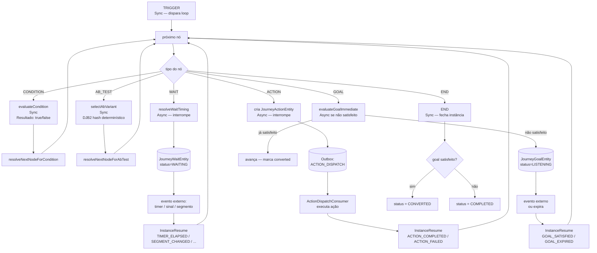

# Jornadas — Nós Subsequentes — Mapa da Engine

> Documento técnico gerado a partir do código-fonte do `prismaflow-mss`, dos prints
> de nós (09 a 14) e das keywords fornecidas. Um dos três documentos do módulo de
> jornadas. Exclui provider-apps e templates por escopo explícito do usuário.
> Data: 2026-06-28.

---

## 1. Resumo executivo

Um grafo de jornada é composto por nós. O nó de entrada (`TRIGGER`) é o ponto de
partida — descrito no documento de gatilhos. Os nós subsequentes são:
**CONDITION** (ramificação lógica), **WAIT** (espera com 6 variações), **ACTION**
(envio/ação com variáveis e overrides), **AB_TEST** (divisão determinística de
variantes), **GOAL** (objetivo de conversão) e **END** (terminal de ramo).

Cada nó tem uma classificação interna — **síncrono** ou **assíncrono** — que determina
se a progressão da instância continua no mesmo loop de processamento ou se é
interrompida até um evento externo resumir. Essa classificação não é visível na UI.

---

## 2. Glossário e keywords

| Termo na UI | Nome no código |
|---|---|
| Nó | `JourneyNodeType` (enum, 7 valores) |
| Condição | `JourneyNodeType.CONDITION = "condition"` |
| Espera | `JourneyNodeType.WAIT = "wait"` |
| Ação | `JourneyNodeType.ACTION = "action"` |
| Teste A/B | `JourneyNodeType.AB_TEST = "ab_test"` |
| Objetivo | `JourneyNodeType.GOAL = "goal"` |
| Fim | `JourneyNodeType.END = "end"` |
| Duração fixa | `JourneyWaitKind.DURATION = "duration"` |
| Até data/hora | `JourneyWaitKind.UNTIL_DATETIME = "until_datetime"` |
| Até evento | `JourneyWaitKind.UNTIL_EVENT = "until_event"` |
| Até condição | `JourneyWaitKind.UNTIL_CONDITION = "until_condition"` |
| Até segmento | `JourneyWaitKind.UNTIL_SEGMENT = "until_segment"` |
| Janela operacional | `JourneyWaitKind.OPERATIONAL_WINDOW = "operational_window"` |
| Evento de conversão | `JourneyGoalType.GOAL_EVENT = "goal_event"` |
| Condição de conversão | `JourneyGoalType.GOAL_CONDITION = "goal_condition"` |
| Interromper se falhar | `JourneyActionFailurePolicy.HALT = "halt"` |
| Continuar se falhar | `JourneyActionFailurePolicy.CONTINUE = "continue"` |
| Variáveis da ação | `variable_mapping: VariableMapping[]` |
| Overrides | `overrides: ActionOverride[]` |
| Variante A/B | `JourneyNodeAbTestVariant { key, weight }` |
| Nó síncrono | `ProgressionClassification.SYNC` — não interrompe o loop |
| Nó assíncrono | `ProgressionClassification.ASYNC` — interrompe o loop, aguarda evento externo |
| Tempo limite (objetivo) | `goalConfig.timeout { value, unit }` |

---

## 3. Visão geral do fluxo



A progressão é um `for(;;)` com no máximo 100 iterações (`checkLoopGuard`). Nós
síncronos avançam dentro do mesmo loop. Nós assíncronos gravam seu estado persistente
e retornam — a retomada vem de um `InstanceResume` externo.

---

## 4. Classificação: síncrono vs. assíncrono

```typescript
// apps/v1-api-journey/src/domain/progress-engine.ts:184-199
export function classifyNodeProgression(nodeType: JourneyNodeType): ProgressionClassification {
  switch (nodeType) {
    case JourneyNodeType.TRIGGER:
    case JourneyNodeType.CONDITION:
    case JourneyNodeType.AB_TEST:
    case JourneyNodeType.END:
      return ProgressionClassification.SYNC;   // continua o loop
    case JourneyNodeType.WAIT:
    case JourneyNodeType.ACTION:
    case JourneyNodeType.GOAL:
      return ProgressionClassification.ASYNC;  // interrompe — aguarda evento externo
  }
}
```

**Por que isso importa:** nós síncronos em sequência (ex.: CONDITION → CONDITION → END)
são processados em uma única chamada ao `InstanceProgressConsumer`, sem publicar
mensagem Kafka intermediária. Nós assíncronos sempre publicam uma mensagem de retomada
antes do próximo passo.

---

## 5. CONDITION — Nó de condição

### 5.1 Configuração e UI

O nó de condição ramifica o perfil em dois caminhos: "Sim" (borda `true`) e "Não"
(borda `false`). Cada condição é composta por um ou mais critérios conectados por
operadores booleanos.

```typescript
// packages/shared/src/types/index.ts:1186-1219
interface JourneyNodeConditionConfig {
  op: BooleanOp;         // AND | OR | NOT
  clauses: JourneyConditionClause[];
}

type JourneyConditionClause =
  | { type: "trait";     trait_key: string; where: WhereExpression }
  | { type: "identity";  identity_type: string; where: WhereExpression }
  | { type: "last_event"; event_key: string; window?: Duration; where?: WhereExpression }
  | { type: "group";     op: BooleanOp; clauses: JourneyConditionClause[] }  // aninhamento
```

### 5.2 Origens de dado (3 tipos de cláusula)

#### 5.2.1 Trait (`type: "trait"`)

Lê os traits do perfil via Customer360 (MongoDB) usando gRPC. A expressão `where` é
avaliada pelo DSL `evaluateWhere` sobre o valor do trait.

```typescript
// apps/v1-api-journey/src/domain/evaluate-condition.ts:89-112
case "trait": {
  const traitValue = getTraitValue(clause.trait_key, profileTraits, triggerTraits);
  return evaluateWhere(clause.where, traitValue, context);
}
```

**`triggerTraits` injection**: quando o gatilho foi `ON_TRAIT_UPDATED`, o novo valor
do trait que disparou o sinal é injetado em memória antes da avaliação. Isso garante
que o CONDITION vê o valor mais atual mesmo que o Customer360 ainda não tenha replicado.

```typescript
// apps/v1-api-journey/src/domain/evaluate-condition.ts:63-73
function getTraitValue(traitKey, profileTraits, triggerTraits): unknown {
  const injected = triggerTraits?.get(traitKey);
  if (injected !== undefined) return injected;      // valor do sinal tem prioridade
  return profileTraits.get(traitKey)?.value ?? null;
}
```

#### 5.2.2 Identidade (`type: "identity"`)

Verifica se o perfil possui uma identidade de determinado tipo e avalia `where` sobre
o valor dessa identidade.

```typescript
// apps/v1-api-journey/src/domain/evaluate-condition.ts:114-129
case "identity": {
  const identity = profileIdentities.find((i) => i.identityType === clause.identity_type);
  const value = identity?.identityValue ?? null;
  return evaluateWhere(clause.where, value, context);
}
```

A identidade é obtida do `profile.identities` (Customer360). Se não houver identidade
do tipo configurado, `value = null`.

#### 5.2.3 Último evento (`type: "last_event"`)

Consulta o ClickHouse para buscar o último evento do perfil com o `event_key`
especificado dentro de uma janela de tempo opcional (`window`).

```typescript
// apps/v1-api-journey/src/domain/evaluate-condition.ts:131-164
case "last_event": {
  const windowMs = clause.window ? durationToMs(clause.window) : undefined;
  const since = windowMs ? new Date(now - windowMs) : undefined;

  const lastEvent = await rawEventRepository.findLastEventForProfile({
    appId, profileId, eventKey: clause.event_key, since
  });

  if (!lastEvent) return false;    // sem evento no período = false
  if (!clause.where) return true;  // qualquer ocorrência basta
  return evaluateWhere(clause.where, lastEvent.properties, context);
}
```

A consulta ao ClickHouse é a mais custosa. Se `window` não for definida, busca o evento
mais recente sem limite de tempo.

### 5.3 Avaliação booleana

```typescript
// apps/v1-api-journey/src/domain/evaluate-condition.ts:38-55
async function evaluateClause(clause, context): Promise<boolean> {
  switch (clause.op) {
    case BooleanOp.AND:
      for (const sub of clause.clauses) { if (!await evaluateClause(sub, context)) return false; }
      return true;
    case BooleanOp.OR:
      for (const sub of clause.clauses) { if (await evaluateClause(sub, context)) return true; }
      return false;
    case BooleanOp.NOT:
      return !(await evaluateClause(clause.clauses[0], context));
  }
}
```

A avaliação usa short-circuit: `AND` retorna `false` no primeiro subcritério falso;
`OR` retorna `true` no primeiro subcritério verdadeiro. Evita consultas desnecessárias
ao ClickHouse.

### 5.4 Arestas (edges) de saída

```typescript
// apps/v1-api-journey/src/domain/progress-engine.ts:203-215
export function resolveNextNodeForCondition(
  compiledGraph: CompiledGraph,
  currentNodeId: string,
  result: boolean
): string | null {
  const edge = compiledGraph.edges.find(
    (e) => e.source === currentNodeId && e.label === (result ? "true" : "false")
  );
  return edge?.target ?? null;
}
```

Aresta rotulada `"true"` → perfil satisfez a condição. Aresta `"false"` → não satisfez.
Se não houver aresta para aquele ramo, a instância é completada.

---

## 6. WAIT — Nó de espera (6 variações)

```typescript
// apps/v1-api-journey/src/domain/resolve-wait-timing.ts:1-120
export function resolveWaitTiming(nodeConfig: JourneyNodeWaitConfig, now: Date): WaitTiming
```

### 6.1 DURATION — Espera por duração fixa

```typescript
case JourneyWaitKind.DURATION: {
  const ms = durationToMs(config.duration);  // value * ms_per_unit
  return {
    resumeAt: new Date(now.getTime() + ms),
    expiresAt: null,
  };
}
```

Configuração: `{ kind: "duration", duration: { value: 2, unit: "day" } }`. O `resumeAt`
é gravado em `journey_waits.resume_at`. O `WaitScheduleTickConsumer` busca registros com
`resume_at <= now` e publica `InstanceResume(TIMER_ELAPSED)`.

Unidades suportadas: `minute`, `hour`, `day` (`TimeUnit`).

### 6.2 UNTIL_DATETIME — Espera até data/hora específica

```typescript
case JourneyWaitKind.UNTIL_DATETIME: {
  return {
    resumeAt: new Date(config.datetime),  // ISO string configurada na UI
    expiresAt: null,
  };
}
```

Funciona igual ao `DURATION` — grava `resume_at` e é avançado pelo tick timer. Se a
data já passou quando o perfil chega no nó, o `WaitScheduleTickConsumer` o retoma
imediatamente no próximo tick.

### 6.3 UNTIL_EVENT — Espera até evento ocorrer

```typescript
case JourneyWaitKind.UNTIL_EVENT: {
  return {
    resumeAt: null,                                        // sem timer automático
    expiresAt: config.timeout ? new Date(now + timeout) : null,
  };
}
```

O `JourneyWaitEntity` é criado com `wait_kind = until_event` e `expires_at` opcional.
O consumer `MatchEventToWaits` (escuta tópico de eventos) verifica se o perfil tem
wait ativo que aguarda aquele `event_key` e publica `InstanceResume(EVENT_RECEIVED)`.
Se `expiresAt` for atingido antes, o `WaitScheduleTickConsumer` publica
`InstanceResume(EXPIRED)`.

### 6.4 UNTIL_CONDITION — Espera até condição ser satisfeita

```typescript
case JourneyWaitKind.UNTIL_CONDITION: {
  return {
    resumeAt: null,
    expiresAt: config.timeout ? new Date(now + timeout) : null,
  };
}
```

O consumer `MatchConditionToActiveWaits` reavalia a condição do nó quando um evento
externo relevante (trait atualizado, evento de identidade) chega. Publica
`InstanceResume(CONDITION_MET)` quando a condição for satisfeita. Expiração funciona
igual ao `UNTIL_EVENT`.

### 6.5 UNTIL_SEGMENT — Espera até mudança de segmento

```typescript
case JourneyWaitKind.UNTIL_SEGMENT: {
  return {
    resumeAt: null,
    expiresAt: config.timeout ? new Date(now + timeout) : null,
  };
}
```

O consumer de eventos de segmento verifica se há waits ativos aguardando entrada ou
saída de um segmento específico. Publica `InstanceResume(SEGMENT_CHANGED)`. A
configuração especifica: `segment_id`, e se aguarda `entered` ou `left`.

### 6.6 OPERATIONAL_WINDOW — Janela operacional

```typescript
case JourneyWaitKind.OPERATIONAL_WINDOW: {
  const resumeAt = computeOperationalWindowResume(now, config);
  return {
    resumeAt,  // próximo horário dentro da janela (pode ser now se já estiver dentro)
    expiresAt: config.timeout ? new Date(now + config.timeout) : null,
  };
}
```

`computeOperationalWindowResume` calcula o próximo instante que cai dentro do range
horário configurado (ex.: 08:00–20:00) considerando o timezone do app. Se já estiver
dentro do horário, `resumeAt` é `now` — o tick imediato já retoma.

Configuração: `{ kind: "operational_window", start_time, end_time, timezone, timeout? }`.

### 6.7 Entidades e modelo de dados

```
Tabela: journey_waits (PostgreSQL journey-rds)
```

| Coluna | Tipo | Uso |
|---|---|---|
| `instance_id` | UUID | FK para `journey_instances` |
| `node_id` | TEXT | Nó de espera do grafo |
| `wait_kind` | TEXT | `duration | until_datetime | until_event | until_condition | until_segment | operational_window` |
| `status` | TEXT | `waiting | resumed | expired` |
| `resume_at` | TIMESTAMPTZ | Timestamp de retomada automática (null para waits por evento) |
| `expires_at` | TIMESTAMPTZ | Timeout máximo (null se não configurado) |
| `config` | JSONB | Config completa do nó de espera |
| `resumed_at` | TIMESTAMPTZ | Quando foi de fato retomado |
| `resumed_reason` | TEXT | `timer_elapsed | expired | event_received | condition_met | segment_changed` |

---

## 7. ACTION — Nó de ação

### 7.1 Tipos de ação

```typescript
// packages/shared/src/types/index.ts:1295-1299
enum JourneyActionType {
  PUSH = "push",
  WEBHOOK = "webhook",
  ENTER_JOURNEY = "enter_journey",
}
```

`PUSH` e `WEBHOOK` são template-backed — usam `template_id` para resolver o conteúdo.
`ENTER_JOURNEY` não usa template — referencia diretamente outro `journey_id`.
O detalhe de provider/template está fora do escopo deste documento.

### 7.2 Criação do JourneyActionEntity

```typescript
// apps/v1-api-journey/src/consumers/instance-progress.consumer.ts:389-430
case JourneyNodeType.ACTION: {
  const resolvedVariables = await resolveActionVariables(
    nodeConfig.variable_mapping ?? [],
    profile,
    { entryEventProperties: instance.entryEventProperties }
  );

  const actionEntity = JourneyActionEntity.create({
    appId,
    instanceId, nodeId, stepSeq,
    actionType: nodeConfig.action_type,
    status: JourneyActionStatus.QUEUED,
    requestPayload: {
      template_id: nodeConfig.template_id,
      action_type: nodeConfig.action_type,
      variables: resolvedVariables,
      overrides: nodeConfig.overrides,       // layer + path overrides
      on_failure: nodeConfig.on_failure,     // CONTINUE | HALT
      target_journey_id: nodeConfig.target_journey_id,  // só para ENTER_JOURNEY
    },
  });

  await journeyActionRepository.create(actionEntity, client);
  await journeyOutboxEventRepository.insert(ACTION_DISPATCH, client);

  return { classification: ASYNC, nextStep: null };  // interrompe o loop
}
```

A progressão interrompe aqui. O despacho real acontece no `ActionDispatchConsumer`.

### 7.3 Variáveis — `resolveActionVariables`

```typescript
// apps/v1-api-journey/src/domain/resolve-action-variables.ts:1-110
export async function resolveActionVariables(
  mapping: VariableMapping[],
  profile: ProfileData,
  context: { entryEventProperties?: Record<string, unknown> }
): Promise<Record<string, unknown>> {
  const resolved: Record<string, unknown> = {};

  for (const map of mapping) {
    const value = await resolveVariableSource(map.source, profile, context);
    resolved[map.variable_key] = value ?? map.source.default;  // fallback para default
  }

  return resolved;
}
```

Quatro origens de dado para cada variável:

| Origem | Código | Exemplo de uso |
|---|---|---|
| `literal` | `source.value` direto | Valor fixo definido na UI |
| `trait` | `profile.traits[trait_key].value` via MongoDB | Nome do perfil, plano, etc. |
| `identity` | `profile.identities.find(i => i.type === identity_type).value` | Email, telefone, etc. |
| `function` | `resolveActionFunction(fn_name, args, context)` | `entry_event_property`, `now_iso`, etc. |

A função `resolveActionFunction` avalia funções pré-definidas:
- `"entry_event_property"` → lê `context.entryEventProperties[arg]` (ex.: nome do segmento que disparou)
- `"now_iso"` → timestamp atual ISO 8601
- `"profile_id"` → ID do perfil

Se uma variável não puder ser resolvida, o `fallback` (campo `default` na UI) é usado.
Para traits, `inferScalar(defaultValue)` converte a string de default para boolean ou
número se o tipo for inferível.

### 7.4 Overrides — `validateActionOverrides`

```typescript
// apps/v1-api-journey/src/domain/validate-action-overrides.ts:1-185
export function validateActionOverrides(
  overrides: ActionOverride[],
  templateConfig: TemplateConfigSnapshot
): ValidationResult
```

Dois tipos de override:

**Layer override** (`key: "layer.{layerId}"`)

Seleciona uma variante de um layer do template. O `layerId` é o ID do layer no
template; o `value` é o `variant_id` dentro desse layer.

```typescript
// apps/v1-api-journey/src/domain/validate-action-overrides.ts:52-73
if (override.key.startsWith("layer.")) {
  const layerId = override.key.split(".")[1];
  const layer = templateConfig.layers.find((l) => l.id === layerId);
  if (!layer) return { valid: false, error: `Layer not found: ${layerId}` };

  const variant = layer.variants.find((v) => v.id === override.value);
  if (!variant) return { valid: false, error: `Variant not found in layer ${layerId}` };
}
```

**Path override** (qualquer outra chave)

Override de um campo específico do conteúdo do template. A chave usa dot-notation
(ex.: `"push.title"`, `"push.body.pt_BR"`).

Validações aplicadas:
1. Chave deve existir em `templateConfig.paths` (schema de campos permitidos)
2. AJV valida o valor contra o schema JSON do path
3. Se o valor for string localizada, valida cada locale
4. Verifica que placeholders usados no valor existem em `templateConfig.placeholders`
   e que todas as sources de placeholder estão configuradas

### 7.5 Política de falha

```typescript
// packages/shared/src/types/index.ts:1303-1306
enum JourneyActionFailurePolicy {
  CONTINUE = "continue",
  HALT = "halt",
}
```

Se a ação falhar no `ActionDispatchConsumer`:
- `CONTINUE`: publica `InstanceResume(ACTION_FAILED)` e a instância avança pelo ramo
  de falha (se existir) ou continua normalmente
- `HALT`: marca a instância como `FAILED` e encerra

Na UI: checkbox "Interromper a instância se esta ação falhar". Por padrão: `CONTINUE`.

### 7.6 Entidades e modelo de dados

```
Tabela: journey_actions (PostgreSQL journey-rds)
```

| Coluna | Tipo | Uso |
|---|---|---|
| `instance_id` | UUID | FK para `journey_instances` |
| `node_id` | TEXT | Nó de ação do grafo |
| `step_seq` | INT | Número do passo — idempotência |
| `action_type` | TEXT | `push | webhook | enter_journey` |
| `status` | TEXT | `queued | dispatched | completed | failed` |
| `request_payload` | JSONB | Template ID, variáveis resolvidas, overrides |
| `response_payload` | JSONB | Resposta do provider (preenchido pós-dispatch) |
| `on_failure` | TEXT | `continue | halt` |
| `dispatched_at` | TIMESTAMPTZ | Quando foi despachado |
| `completed_at` | TIMESTAMPTZ | Quando terminou (sucesso ou falha) |

---

## 8. AB_TEST — Nó de teste A/B

### 8.1 Variantes e pesos

```typescript
// packages/shared/src/types/index.ts:1220-1228
interface JourneyNodeAbTestConfig {
  variants: JourneyNodeAbTestVariant[];
}

interface JourneyNodeAbTestVariant {
  key: string;      // "A", "B", "C" — rótulo da borda de saída
  weight: number;   // 1-99, soma dos pesos deve ser 100
}
```

### 8.2 Algoritmo de atribuição — DJB2 hash

```typescript
// apps/v1-api-journey/src/domain/select-ab-variant.ts:1-58
function hashDjb2(str: string): number {
  let hash = 5381;
  for (let i = 0; i < str.length; i++) {
    hash = ((hash << 5) + hash + str.charCodeAt(i)) >>> 0;
  }
  return hash;
}

export function selectAbVariant(
  appId: string,
  journeyVersionId: string,
  instanceId: string,
  nodeId: string,
  variants: JourneyNodeAbTestVariant[]
): string {
  const hashInput = `${appId}:${journeyVersionId}:${instanceId}:${nodeId}`;
  const hash = hashDjb2(hashInput);
  const bucket = hash % 100;  // 0-99

  let cumulative = 0;
  for (const variant of variants) {
    cumulative += variant.weight;
    if (bucket < cumulative) return variant.key;
  }

  return variants[variants.length - 1].key;  // fallback
}
```

**Propriedades do algoritmo:**
- **Determinístico**: o mesmo perfil sempre recebe a mesma variante na mesma versão
  de jornada, no mesmo nó. Idêntico ao "Re-sorteia a variante a cada nova entrada"
  mostrado na UI — quando o perfil entra novamente (`instanceId` novo), o hash muda.
- **Sem aleatoriedade**: não usa `Math.random()`. Dado `appId + versionId + instanceId + nodeId`,
  o bucket é sempre o mesmo.
- **Distribuição**: DJB2 distribui uniformemente; com `% 100` e pesos `[50, 50]`, cada
  variante tem exatamente 50% dos perfis.

### 8.3 Arestas de saída

```typescript
// apps/v1-api-journey/src/domain/progress-engine.ts:217-229
export function resolveNextNodeForAbTest(
  compiledGraph: CompiledGraph,
  currentNodeId: string,
  selectedVariantKey: string
): string | null {
  const edge = compiledGraph.edges.find(
    (e) => e.source === currentNodeId && e.label === selectedVariantKey
  );
  return edge?.target ?? null;
}
```

Cada variante corresponde a uma aresta com `label === variant.key`. Uma variante sem
aresta definida leva à conclusão da instância.

---

## 9. GOAL — Nó de objetivo

### 9.1 Tipos de objetivo

```typescript
// packages/shared/src/types/index.ts:1308-1311
enum JourneyGoalType {
  GOAL_EVENT = "goal_event",        // evento de conversão específico
  GOAL_CONDITION = "goal_condition", // condição sobre traits/identidade
}
```

Na UI: "Evento de conversão" (GOAL_EVENT). `GOAL_CONDITION` existe no código mas não
foi confirmado se está exposto na UI atual.

### 9.2 Avaliação imediata (`evaluateGoalImmediate`)

```typescript
// apps/v1-api-journey/src/domain/evaluate-goal.ts:1-65
export async function evaluateGoalImmediate(
  appId, profileId, goalConfig, instanceEntryAt, now
): Promise<GoalImmediateResult> {
  if (goalConfig.type === JourneyGoalType.GOAL_EVENT) {
    // Busca no ClickHouse o último evento com event_key correspondente,
    // APÓS a entrada da instância (instanceEntryAt)
    const event = await rawEventRepository.findLastEventForProfile({
      appId, profileId,
      eventKey: goalConfig.event_key,
      since: instanceEntryAt,
    });
    return { satisfied: event !== null, satisfiedAt: event?.event_time ?? null };
  }

  if (goalConfig.type === JourneyGoalType.GOAL_CONDITION) {
    // Avalia condição igual ao nó CONDITION
    const result = await evaluateCondition(...);
    return { satisfied: result, satisfiedAt: result ? now : null };
  }
}
```

**Importante**: a janela de busca começa em `instanceEntryAt`, não em `now`. Isso
garante que um evento que ocorreu após a entrada na jornada (mas antes de chegar ao
nó GOAL) conta como conversão.

### 9.3 Fluxo — satisfeito vs. em escuta

```typescript
// apps/v1-api-journey/src/consumers/instance-progress.consumer.ts:328-388
case JourneyNodeType.GOAL: {
  const { satisfied, satisfiedAt } = await evaluateGoalImmediate(...);

  if (satisfied) {
    // Marca o objetivo como convertido na instância
    await markInstanceGoalSatisfied(instanceId, satisfiedAt, client);
    return { classification: SYNC, nextNode: resolveNextNodeForGoal("converted") };
  }

  // Não satisfeito: cria JourneyGoalEntity e aguarda
  const expiresAt = resolveGoalTimeout(goalConfig, now);
  const goalEntity = JourneyGoalEntity.create({
    appId, instanceId, nodeId, stepSeq,
    status: JourneyGoalStatus.LISTENING,
    goalType: goalConfig.type,
    eventKey: goalConfig.event_key,
    expiresAt,
  });

  await journeyGoalRepository.create(goalEntity, client);
  return { classification: ASYNC, nextStep: null };  // aguarda evento de conversão
}
```

### 9.4 Timeout do objetivo

```typescript
// apps/v1-api-journey/src/domain/progress-engine.ts:245-258
export function resolveGoalTimeout(goalConfig, now): Date | null {
  if (!goalConfig.timeout) return null;  // sem expiração
  const ms = durationToMs(goalConfig.timeout);
  return new Date(now.getTime() + ms);
}
```

Campo UI "Tempo limite" com unidade (minuto/hora/dia). Se `expiresAt` for atingido,
o `GoalExpirationTickConsumer` publica `InstanceResume(GOAL_EXPIRED)` e a instância
avança pelo ramo `"not_converted"`.

### 9.5 Arestas de saída

```typescript
// apps/v1-api-journey/src/domain/progress-engine.ts:231-243
export function resolveNextNodeForGoal(
  compiledGraph, currentNodeId,
  label: "converted" | "not_converted"
): string | null {
  const edge = compiledGraph.edges.find((e) => e.source === currentNodeId && e.label === label);
  return edge?.target ?? null;
}
```

Aresta `"converted"` → objetivo satisfeito. Aresta `"not_converted"` → objetivo expirou
sem conversão (ou branch alternativo).

### 9.6 Consumer de verificação

O `GoalCheckConsumer` escuta tópicos de eventos e verifica se há instâncias em
`LISTENING` aguardando aquele evento:

```typescript
// apps/v1-api-journey/src/consumers/goal-check.consumer.ts
// Para cada evento recebido:
// 1. Busca journey_goals com status=LISTENING e event_key correspondente
// 2. Para cada goal encontrado, publica InstanceResume(GOAL_SATISFIED)
```

### 9.7 Entidades e modelo de dados

```
Tabela: journey_goals (PostgreSQL journey-rds)
```

| Coluna | Tipo | Uso |
|---|---|---|
| `instance_id` | UUID | FK para `journey_instances` |
| `node_id` | TEXT | Nó de objetivo do grafo |
| `step_seq` | INT | Número do passo |
| `status` | TEXT | `listening | satisfied | expired` |
| `goal_type` | TEXT | `goal_event | goal_condition` |
| `event_key` | TEXT | Evento aguardado (para `goal_event`) |
| `expires_at` | TIMESTAMPTZ | Expiração (null se sem timeout) |
| `satisfied_at` | TIMESTAMPTZ | Quando foi satisfeito |

---

## 10. END — Nó de fim

### 10.1 Status de encerramento

```typescript
// apps/v1-api-journey/src/consumers/instance-progress.consumer.ts:448-490
case JourneyNodeType.END: {
  const hasConvertedGoal = instance.goalSatisfiedAt !== null;

  const finalStatus = hasConvertedGoal
    ? JourneyInstanceStatus.CONVERTED
    : JourneyInstanceStatus.COMPLETED;

  await journeyInstanceRepository.updateStatus(instanceId, finalStatus, now, client);

  // Outbox: INSTANCE_COMPLETED ou INSTANCE_CONVERTED
  await journeyOutboxEventRepository.insert(
    hasConvertedGoal ? OutboxEvent.INSTANCE_CONVERTED : OutboxEvent.INSTANCE_COMPLETED,
    client
  );

  // Histórico
  await journeyInstanceHistoryRepository.create(finalStatus, client);

  return { classification: SYNC };  // loop termina — não há próximo nó
}
```

O nó `END` é síncrono. Não aguarda nada — finaliza a instância e encerra o loop.

| Status | Condição |
|---|---|
| `COMPLETED` | A instância chegou ao END sem que nenhum GOAL fosse satisfeito |
| `CONVERTED` | A instância chegou ao END e pelo menos um GOAL foi satisfeito durante o caminho |

Um grafo pode ter múltiplos nós END (um por ramo). Cada ramo que chegar ao seu END
finaliza a instância com o mesmo critério acima.

### 10.2 O que acontece se não houver END

Se `resolveNextNode` retornar `null` (aresta inexistente a partir de um nó síncrono),
a instância é completada implicitamente — sem nó END explícito. Isso pode ocorrer em
grafos com ramos incompletos.

---

## 11. Progressão — mecanismos de retomada por tipo de nó

| Nó async | Retomada via | Evento Kafka |
|---|---|---|
| WAIT (duration/datetime) | `WaitScheduleTickConsumer` | `InstanceResume(TIMER_ELAPSED)` |
| WAIT (until_event) | `MatchEventToWaits` | `InstanceResume(EVENT_RECEIVED)` |
| WAIT (until_condition) | `MatchConditionToActiveWaits` | `InstanceResume(CONDITION_MET)` |
| WAIT (until_segment) | `SegmentEventsConsumer` → match waits | `InstanceResume(SEGMENT_CHANGED)` |
| WAIT (qualquer, expired) | `WaitScheduleTickConsumer` | `InstanceResume(EXPIRED)` |
| ACTION (completed) | `ActionDispatchConsumer` | `InstanceResume(ACTION_COMPLETED)` |
| ACTION (failed, halt) | `ActionDispatchConsumer` | `InstanceResume(ACTION_FAILED)` |
| GOAL (satisfied) | `GoalCheckConsumer` | `InstanceResume(GOAL_SATISFIED)` |
| GOAL (expired) | `GoalExpirationTickConsumer` | `InstanceResume(GOAL_EXPIRED)` |

Todos os `InstanceResume` são publicados em `journey.instance_resume.v1` e consumidos
pelo `InstanceResumeConsumer`, que publica em `journey.instance_progress.v1` com o
`step_seq` correto para retomar o loop a partir do passo certo.

---

## 12. Regras de negócio e validações

### 12.1 Loop guard — limite de 100 nós síncronos

```typescript
// apps/v1-api-journey/src/domain/progress-engine.ts:258-268
export function checkLoopGuard(stepsProcessed: number, maxSteps = 100): void {
  if (stepsProcessed >= maxSteps) {
    throw new JourneyProgressionError("MAX_STEPS_EXCEEDED", { stepsProcessed });
  }
}
```

Uma sequência de 100 nós síncronos consecutivos (ex.: 100 CONDITIONs encadeadas) é
tratada como ciclo e lança exceção. A instância vai para `FAILED`. Protege contra
grafos malformados que criariam loop infinito.

### 12.2 Idempotência do step_seq

```typescript
// apps/v1-api-journey/src/consumers/instance-progress.consumer.ts:87-102
function validateStepSeq(instance, incomingStepSeq): void {
  if (incomingStepSeq < instance.currentStepSeq) {
    throw new StaleStepError({ incomingStepSeq, currentStepSeq: instance.currentStepSeq });
  }
}
```

Mensagens de progressão com `step_seq` menor que o atual são descartadas. Garante
que replays e mensagens fora de ordem não reprocessam passos já executados.

### 12.3 Chave de idempotência por (instanceId, stepSeq)

```typescript
// apps/v1-api-journey/src/domain/progress-engine.ts:240-244
export function buildIdempotencyKey(instanceId: string, stepSeq: number): string {
  return `${instanceId}:${stepSeq}`;
}
```

Usada nas ações de banco para evitar dupla gravação de `JourneyActionEntity` ou
`JourneyWaitEntity` quando uma mensagem Kafka é processada mais de uma vez.

### 12.4 FOR UPDATE — progressão exclusiva

```typescript
// apps/v1-api-journey/src/consumers/instance-progress.consumer.ts:79-86
const instance = await journeyInstanceRepository.findByIdForUpdate(instanceId, client);
```

O `FOR UPDATE` garante que apenas um worker processa a instância por vez, mesmo com
múltiplos consumers da mesma partição Kafka em paralelo. Segunda tentativa concorrente
aguarda na fila até o lock ser liberado.

### 12.5 CONDITION com ClickHouse — custo e timeout

A cláusula `last_event` faz uma query ao ClickHouse. Em condições com múltiplas
cláusulas `last_event` com `OR`, o short-circuit pode evitar algumas queries mas não
todas. O timeout da query segue o timeout padrão do ClickHouse configurado no app.

### 12.6 Reentrada e waits órfãos

Se uma instância for cancelada enquanto há um `JourneyWaitEntity` em estado `WAITING`,
o wait não é removido imediatamente. O `WaitScheduleTickConsumer` ou os consumers de
sinal tentarão retomar a instância — o `InstanceResumeConsumer` descartará silenciosamente
ao detectar que a instância não está mais `WAITING`.

---

## 13. Modelo de dados resumido

```
Tabela: journey_instances   — instância de perfil × jornada
Tabela: journey_waits       — registro de cada WAIT node
Tabela: journey_actions     — registro de cada ACTION node
Tabela: journey_goals       — registro de cada GOAL node em LISTENING
Tabela: journey_instance_history — log de mudanças de status
```

Todas as tabelas de nós asíncronos (`journey_waits`, `journey_actions`, `journey_goals`)
têm `(instance_id, step_seq)` como chave de idempotência.

---

## 14. Índice de referências de código

| Referência | Tema |
|---|---|
| `apps/v1-api-journey/src/domain/progress-engine.ts:184-199` | `classifyNodeProgression` — sync vs async |
| `apps/v1-api-journey/src/domain/progress-engine.ts:203-243` | `resolveNextNode` para condition/ab_test/goal |
| `apps/v1-api-journey/src/domain/progress-engine.ts:245-268` | `resolveGoalTimeout`, `checkLoopGuard` |
| `apps/v1-api-journey/src/domain/evaluate-condition.ts:38-164` | Avaliação de condição — 3 origens |
| `apps/v1-api-journey/src/domain/evaluate-condition.ts:63-73` | `getTraitValue` — `triggerTrait` injection |
| `apps/v1-api-journey/src/domain/resolve-wait-timing.ts:1-120` | `resolveWaitTiming` — 6 variações |
| `apps/v1-api-journey/src/domain/select-ab-variant.ts:1-58` | `selectAbVariant` — DJB2 hash |
| `apps/v1-api-journey/src/domain/resolve-action-variables.ts:1-110` | `resolveActionVariables` — 4 origens |
| `apps/v1-api-journey/src/domain/validate-action-overrides.ts:1-185` | `validateActionOverrides` — layer + path |
| `apps/v1-api-journey/src/domain/evaluate-goal.ts:1-65` | `evaluateGoalImmediate` |
| `apps/v1-api-journey/src/consumers/instance-progress.consumer.ts:87-102` | `validateStepSeq` — idempotência |
| `apps/v1-api-journey/src/consumers/instance-progress.consumer.ts:79-86` | `FOR UPDATE` — lock exclusivo |
| `apps/v1-api-journey/src/consumers/instance-progress.consumer.ts:328-490` | Handlers de cada tipo de nó |
| `apps/v1-api-journey/src/consumers/wait-schedule-tick.consumer.ts` | Resume de waits por timer |
| `apps/v1-api-journey/src/consumers/goal-check.consumer.ts` | Resume de goals por evento |
| `packages/shared/src/types/index.ts:1186-1228` | Config de CONDITION, AB_TEST |
| `packages/shared/src/types/index.ts:1295-1311` | `JourneyActionType`, `JourneyActionFailurePolicy`, `JourneyGoalType` |

---

## 15. Lacunas e incertezas

1. **UNTIL_CONDITION — consumer que avalia**: `MatchConditionToActiveWaits` foi
   identificado como o componente responsável mas não foi lido em detalhe. Não confirmado
   quais sinais exatamente disparam a reavaliação (supõe-se que trait updates e
   identity events).

2. **UNTIL_SEGMENT — direção de mudança**: A configuração guarda `segment_id` mas não
   foi confirmado no código se o wait é para `entered` ou `left` (ou qualquer mudança).
   Pode haver um campo `direction: "entered" | "left"` no config.

3. **GOAL_CONDITION — exposição na UI**: `JourneyGoalType.GOAL_CONDITION` existe no
   código mas os prints mostram apenas "Evento de conversão". Não confirmado se está
   acessível na UI atual.

4. **ACTION — ramo de falha no grafo**: Para `on_failure: CONTINUE`, a instância
   avança por um "ramo de falha". Não foi confirmado se isso é uma aresta especial no
   grafo (ex.: `label="failed"`) ou se segue a aresta padrão de saída do ACTION node.

5. **Múltiplos GOALs em um grafo**: O campo `instance.goalSatisfiedAt` é singular —
   não foi confirmado como o sistema trata grafos com dois nós GOAL em ramos paralelos.

6. **`computeOperationalWindowResume` — implementação detalhada**: A função foi
   identificada mas não lida em detalhe. Não foi confirmado como trata fronteiras de
   dia (ex.: janela das 22:00 às 06:00, que cruza a meia-noite).

7. **ACTION — campos de resposta do provider**: `response_payload` na tabela
   `journey_actions` existe mas o que é gravado lá (e como a UI exibe) não foi rastreado.
   Isso pertence ao documento de provider-apps/templates.
